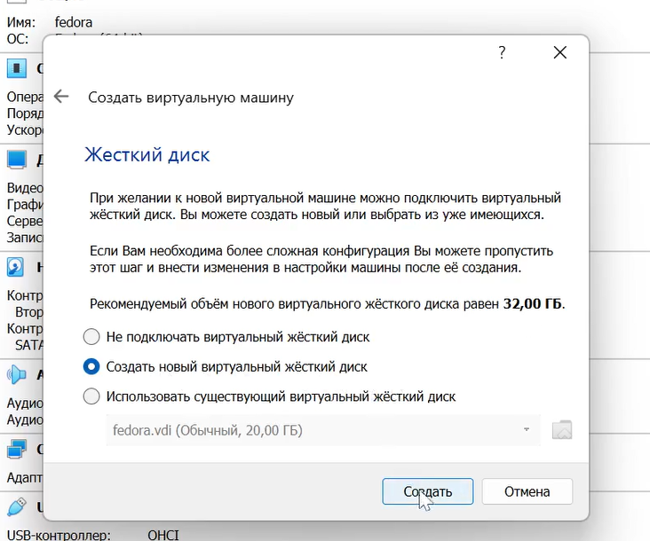

---
## Front matter
lang: ru-RU
title: Презентация к лабораторной работе №1
author: Бабина Ю.О.
group: НПМбд-02-21

## Formatting
toc: false
slide_level: 2
theme: metropolis
header-includes: 
 - \metroset{progressbar=frametitle,sectionpage=progressbar,numbering=fraction}
 - '\makeatletter'
 - '\beamer@ignorenonframefalse'
 - '\makeatother'
aspectratio: 43
section-titles: true
---

# Презентация к лабораторной работе №1

# Цель работы
Цель работы: Приобретение практических навыков
установки операционной системы на виртуальную машину, настройки минимально необходимых для дальнейшей работы сервисов.

# Выполнение работы

## Начальная конфигурация машины

## Выбор объема основной памяти

## Настройка виртуального жесткого диска 

        

## Выбор оптического диска 

## Первый запуск виртуальной машины

## Выбор языка

## Настройка операционной сиситемы перед установкой

## Процесс установки

## Первый запуск установленной ОС

## Установка дополнений гостевой ОС

## Домашнее задание 

# Вывод
## В рамках выполнения данной лабораторной работы я приобрела практический навык установки операционной системы на виртуальную машину и настройки минимально необходимых для дальнейшей работы сервисов.
