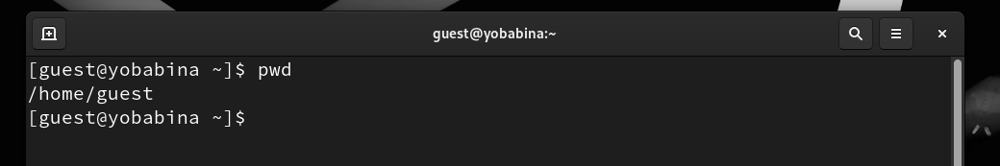
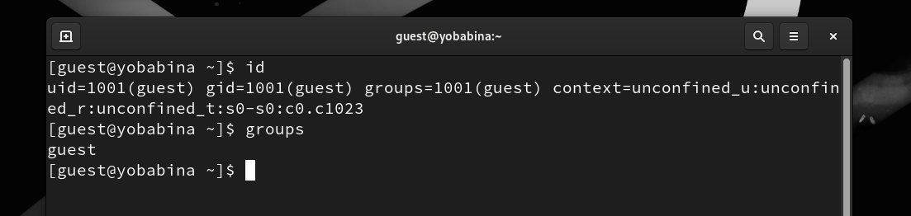

---
## Front matter
lang: ru-RU
title: Презентация к лабораторной работе №2
author: Бабина Ю.О.
group: НПМбд-02-21

## Formatting
toc: false
slide_level: 2
theme: metropolis
header-includes: 
 - \metroset{progressbar=frametitle,sectionpage=progressbar,numbering=fraction}
 - '\makeatletter'
 - '\beamer@ignorenonframefalse'
 - '\makeatother'
aspectratio: 43
section-titles: true
---

# Презентация к лабораторной работе №2

# Цель работы
Получение практических навыков работы в консоли с атрибутами файлов, закрепление теоретических основ дискреционного разграничения доступа в современных системах с открытым кодом на базе ОС Linux.

# Выполнение работы

## Создание пользователя

## Вход в систему от имени пользователя guest:

## Просмотр информации о домашней директории

## Просмотр информации о пользователе

## Просмотр существующих директорий

## Права доступа к созданной папке (по умолчанию и при изменении прав доступа)

## Попытка записи в файл в директории

## Заполнение таблиц

# Вывод
## В рамках выполнения данной лабораторной работы я получила практические навыки работы в консоли с атрибутами файлов, закрепление теоретических основ дискреционного разграничения доступа в современных системах с открытым кодом на базе ОС Linux.