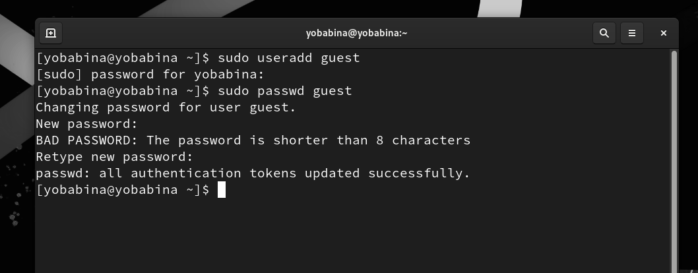
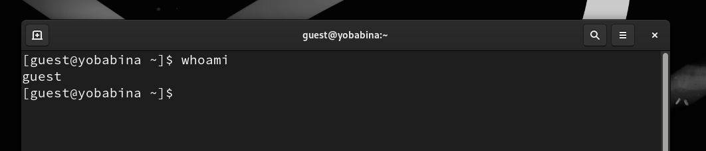
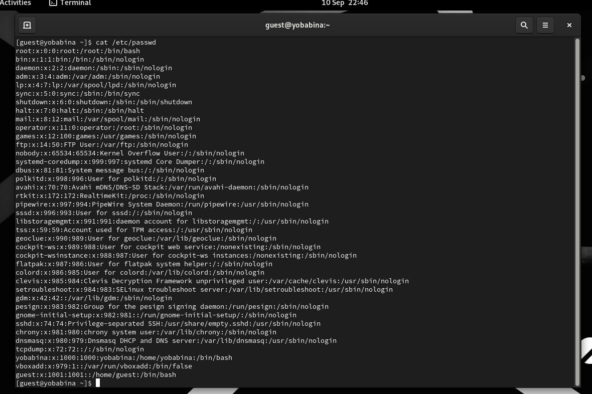
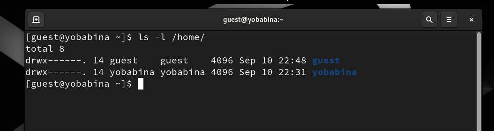
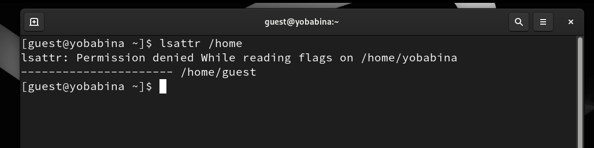
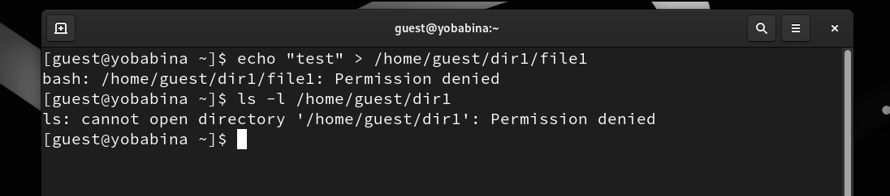

# **Отчет к лабораторной работе №2**
## **Common information**
discipline: Основы информационной безопасности  
group: НПМбд-02-21  
author: Бабина Ю. О.
---
---
## **Цель работы**
Получение практических навыков работы в консоли с атрибутами файлов, закрепление теоретических основ дискреционного разграничения доступа в современных системах с открытым кодом на базе ОС Linux.

## **Выполнение работы**

В установленной при выполнении предыдущей лабораторной работы
операционной системе создадим учётную запись пользователя guest при помощи команды "sudo useradd guest".

Затем зададим пароль для пользователя guest командой: "sudo passwd guest".

Войдем в систему от имени пользователя guest:

Определим директорию, в которой мы находимся, командой "pwd".
Данная директория является домашней для пользователя guest. 

Затем уточним имя нашего пользователя командой "whoami".

Уточним имя нашего пользователя, его группу, а также группы, куда входит пользователь, командой "id". Также сравним вывод "id" с выводом команды groups.

Просмотрим файл /etc/passwd командой
"cat /etc/passwd". 

Как видно, id и gid пользователя guest совпадают с результатами выполнения команд id и groups. 

Определим существующие в системе директории командой
"ls -l /home/"

Нам удалось получить список поддиректорий директории. На все поддиректории установлены все права доступа - чтение, запись, выполнение.

Проверим, какие расширенные атрибуты установлены на поддиректориях, находящихся в директории /home, командой: "lsattr /home".

Итак, расширенные атрибуты директории увидеть не удалось.

Создадим в домашней директории поддиректорию dir1 командой "mkdir dir1". Определим командами "ls -l" и "lsattr", какие права доступа и расширенные атрибуты были выставлены на директорию dir1.

Снимем с директории dir1 все атрибуты командой
"chmod 000 dir1".

Попытаемся создать в директории dir1 файл file1 командой:
"echo "test" > /home/guest/dir1/file1".

Отказ в выполнени операции по созданию файла произошел ввиду снятия прав на все операции с пользователя guest. 

Начнем заполнять таблицу «Установленные права и разрешённые действия», выполняя действия от имени владельца директории (файлов), определив опытным путём, какие операции разрешены, а какие нет.

Для начала для пользователя guest установим права только на чтение dir1 и файла file1, после чего проделаем различные действия с файлом и директорией:

В итоге получилась следующая таблица

|директория|файл|оп. 1|оп. 2|оп. 3|оп. 4|оп. 5|оп. 6|оп. 7|оп. 8|
|----------|----|-----|-----|-----|-----|-----|-----|-----|-----|
|    000   |000 |  -  |  -  |  -  |  -  |  -  |  -  |  -  |  -  |
|    100   |000 |  -  |  -  |  -  |  -  |  +  |  -  |  -  |  -  |
|    200   |000 |  -  |  -  |  -  |  -  |  -  |  -  |  -  |  -  |
|    300   |000 |  +  |  +  |  -  |  -  |  +  |  -  |  +  |  -  |
|    400   |000 |  -  |  -  |  -  |  -  |  -  |  +  |  -  |  -  |
|    500   |000 |  -  |  -  |  -  |  -  |  +  |  +  |  -  |  -  |
|    600   |000 |  -  |  -  |  -  |  -  |  -  |  +  |  -  |  -  |
|    700   |000 |  +  |  +  |  -  |  -  |  +  |  +  |  +  |  -  |
|    000   |100 |  -  |  -  |  -  |  -  |  -  |  -  |  -  |  -  |
|    100   |100 |  -  |  -  |  -  |  -  |  +  |  -  |  -  |  -  |
|    200   |100 |  -  |  -  |  -  |  -  |  -  |  -  |  -  |  -  |
|    300   |100 |  +  |  +  |  -  |  -  |  +  |  -  |  +  |  -  |
|    400   |100 |  -  |  -  |  -  |  -  |  -  |  +  |  -  |  -  |
|    500   |100 |  -  |  -  |  -  |  -  |  +  |  +  |  -  |  -  |
|    600   |100 |  -  |  -  |  -  |  -  |  -  |  +  |  -  |  -  |
|    700   |100 |  +  |  +  |  -  |  -  |  +  |  +  |  +  |  -  |
|    000   |200 |  -  |  -  |  -  |  -  |  -  |  -  |  -  |  -  |
|    100   |200 |  -  |  -  |  +  |  -  |  +  |  -  |  -  |  -  |
|    200   |200 |  -  |  -  |  -  |  -  |  -  |  -  |  -  |  -  |
|    300   |200 |  +  |  +  |  +  |  -  |  +  |  -  |  +  |  -  |
|    400   |200 |  -  |  -  |  -  |  -  |  -  |  +  |  -  |  -  |
|    500   |200 |  -  |  -  |  +  |  -  |  +  |  +  |  -  |  -  |
|    600   |200 |  -  |  -  |  -  |  -  |  -  |  +  |  -  |  -  |
|    700   |200 |  +  |  +  |  +  |  -  |  +  |  +  |  +  |  -  |
|    000   |300 |  -  |  -  |  -  |  -  |  -  |  -  |  -  |  -  |
|    100   |300 |  -  |  -  |  +  |  -  |  +  |  -  |  -  |  -  |
|    200   |300 |  -  |  -  |  -  |  -  |  -  |  -  |  -  |  -  |
|    300   |300 |  +  |  +  |  -  |  +  |  +  |  -  |  +  |  -  |
|    400   |300 |  -  |  -  |  -  |  -  |  -  |  +  |  -  |  -  |
|    500   |300 |  -  |  -  |  +  |  -  |  +  |  +  |  -  |  -  |
|    600   |300 |  -  |  -  |  -  |  -  |  -  |  +  |  -  |  -  |
|    700   |300 |  +  |  +  |  +  |  -  |  +  |  +  |  +  |  -  |
|    000   |400 |  -  |  -  |  -  |  -  |  -  |  -  |  -  |  -  |
|    100   |400 |  -  |  -  |  -  |  +  |  +  |  -  |  -  |  +  |
|    200   |400 |  -  |  -  |  -  |  -  |  -  |  -  |  -  |  -  |
|    300   |400 |  +  |  +  |  -  |  +  |  +  |  -  |  +  |  +  |
|    400   |400 |  -  |  -  |  -  |  -  |  -  |  +  |  -  |  -  |
|    500   |400 |  -  |  -  |  -  |  +  |  +  |  +  |  -  |  +  |
|    600   |400 |  -  |  -  |  -  |  -  |  -  |  +  |  -  |  -  |
|    700   |400 |  +  |  +  |  -  |  +  |  +  |  +  |  +  |  +  |
|    000   |500 |  -  |  -  |  -  |  -  |  -  |  -  |  -  |  -  |
|    100   |500 |  -  |  -  |  -  |  +  |  +  |  -  |  -  |  +  |
|    200   |500 |  -  |  -  |  -  |  -  |  -  |  -  |  -  |  -  |
|    300   |500 |  +  |  +  |  -  |  +  |  +  |  -  |  +  |  +  |
|    400   |500 |  -  |  -  |  -  |  -  |  -  |  +  |  -  |  -  |
|    500   |500 |  -  |  -  |  -  |  +  |  +  |  +  |  -  |  +  |
|    600   |500 |  -  |  -  |  -  |  -  |  -  |  +  |  -  |  -  |
|    700   |500 |  +  |  +  |  -  |  +  |  +  |  +  |  +  |  +  |
|    000   |600 |  -  |  -  |  -  |  -  |  -  |  -  |  -  |  -  |
|    100   |600 |  -  |  -  |  +  |  +  |  +  |  -  |  -  |  +  |
|    200   |600 |  -  |  -  |  -  |  -  |  -  |  -  |  -  |  -  |
|    300   |600 |  +  |  +  |  +  |  +  |  +  |  -  |  +  |  +  |
|    400   |600 |  -  |  -  |  -  |  -  |  -  |  +  |  -  |  -  |
|    500   |600 |  -  |  -  |  +  |  +  |  +  |  +  |  -  |  +  |
|    600   |600 |  -  |  -  |  -  |  -  |  -  |  +  |  -  |  -  |
|    700   |600 |  +  |  +  |  +  |  +  |  +  |  +  |  +  |  +  |
|    000   |700 |  -  |  -  |  -  |  -  |  -  |  -  |  -  |  -  |
|    100   |700 |  -  |  -  |  +  |  +  |  +  |  -  |  -  |  +  |
|    200   |700 |  -  |  -  |  -  |  -  |  -  |  -  |  -  |  -  |
|    300   |700 |  +  |  +  |  +  |  +  |  +  |  -  |  +  |  +  |
|    400   |700 |  -  |  -  |  -  |  -  |  -  |  +  |  -  |  -  |
|    500   |700 |  -  |  -  |  +  |  +  |  +  |  +  |  -  |  +  |
|    600   |700 |  -  |  -  |  -  |  -  |  -  |  +  |  -  |  -  |
|    700   |700 |  +  |  +  |  +  |  +  |  +  |  +  |  +  |  +  |

где
* директория - права доступа директории
* файл права доступа файла
* оп. 1 - создание файла
* оп. 2 - удаление файла
* оп. 3 - запись в файл
* оп. 4 - чтение файла
* оп. 5 - смена директории
* оп. 6 - просмотр файлов в директории
* оп. 7 - переименование файла
* оп. 8 - смена атрибутов файла

Теперь на основе таблицы выше заполним таблицу «Минимально необходимые права для выполнения операций внутри директории»:

|Операция|Директория мин. права|Файл мин. права|
|--------|---------------------|---------------|
|оп. 1   |300                  |000            |
|оп. 2   |300                  |000            |
|оп. 3   |100                  |400            |
|оп. 4   |100                  |200            |
|оп. 5   |300                  |000            |
|оп. 6   |300                  |000            |
|оп. 7   |300                  |000            |

где
* оп. 1 - создание файла
* оп. 2 - удаление файла
* оп. 3 - чтение файла
* оп. 4 - запись в файл
* оп. 5 - переименование файла
* оп. 6 - создание поддиректории
* оп. 7 - переименование файла
* оп. 8 - удаление поддиректории

## **Вывод**
В рамках выполнения данной лабораторной работы я получила практические навыки работы в консоли с атрибутами файлов, закрепление теоретических основ дискреционного разграничения доступа в современных системах с открытым кодом на базе ОС Linux.

## **Список литературы** ##
* https://docs.rockylinux.org/books/admin_guide/06-users/
* https://habr.com/ru/articles/469667/
* https://linux-faq.ru/page/komanda-lsattr

