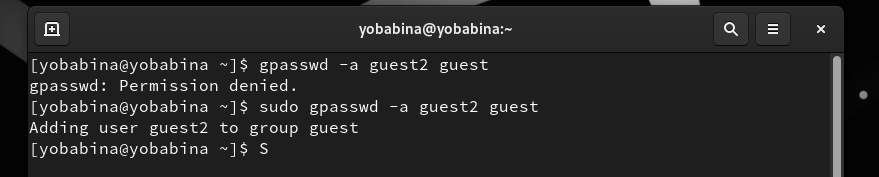
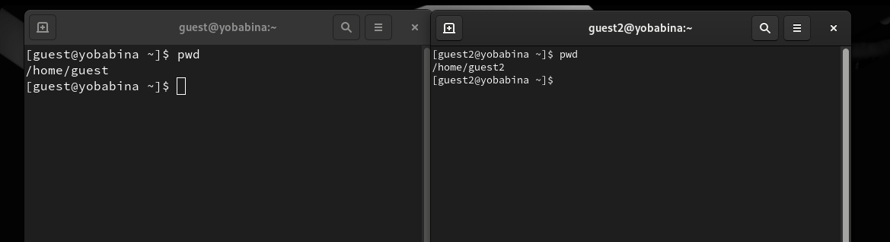
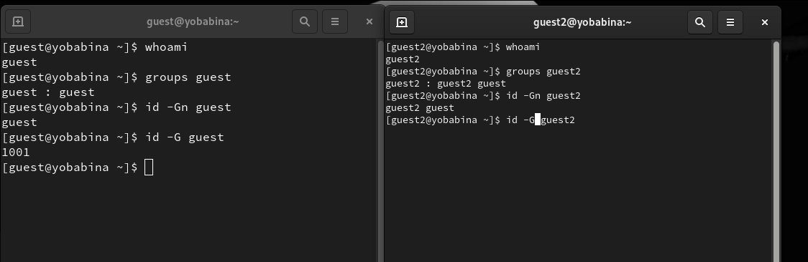
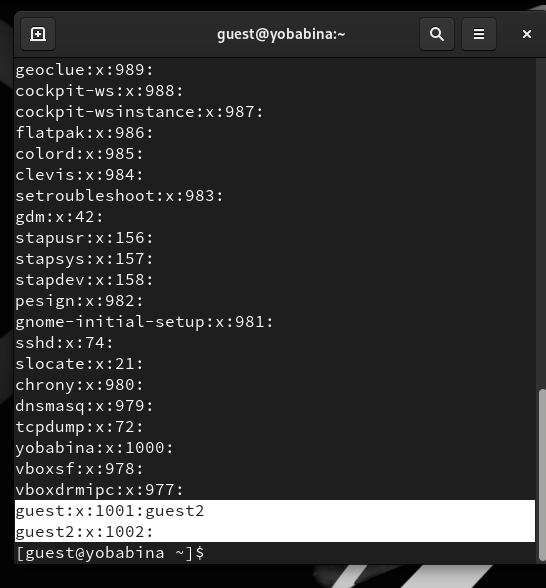
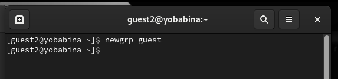
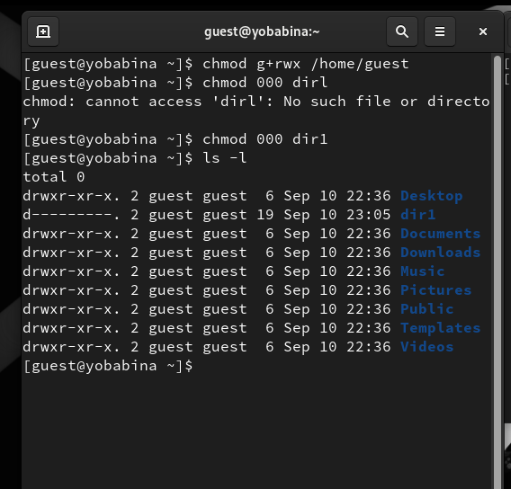
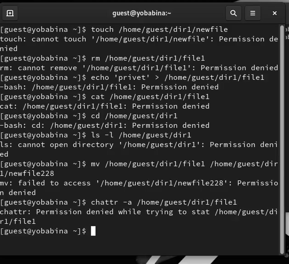

---
## Front matter
lang: ru-RU
title: Презентация к лабораторной работе №3
author: Бабина Ю.О.
group: НПМбд-02-21

## Formatting
toc: false
slide_level: 2
theme: metropolis
header-includes: 
 - \metroset{progressbar=frametitle,sectionpage=progressbar,numbering=fraction}
 - '\makeatletter'
 - '\beamer@ignorenonframefalse'
 - '\makeatother'
aspectratio: 43
section-titles: true
---

# Презентация к лабораторной работе №3

# Цель работы
Получение практических навыков работы в консоли с атрибутами файлов для групп пользователей.

# Выполнение работы

## Создание пользователей

## Добавление пользователя в группу

## Вход в систему от двух пользователей

## Просмотр пути до текущей директории

## Команды id и groups

 

## Файл /etc/group/

 

## Регистрация пользователя в группе

## Заполнение таблиц

# Вывод
## В рамках выполнения данной лабораторной работы я получила практические навыки работы в консоли с атрибутами файлов для групп пользователей.