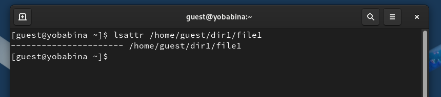
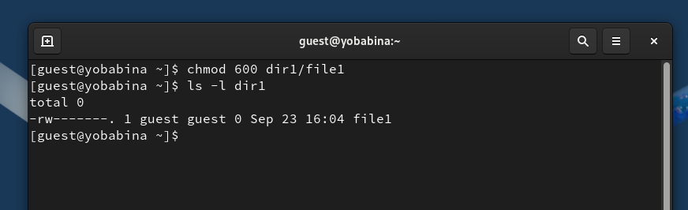
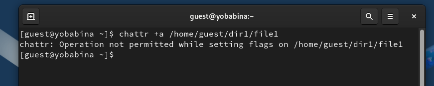
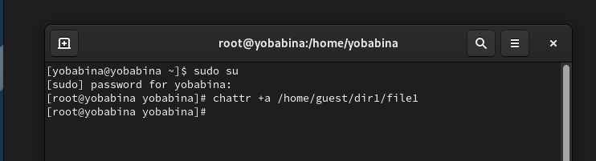
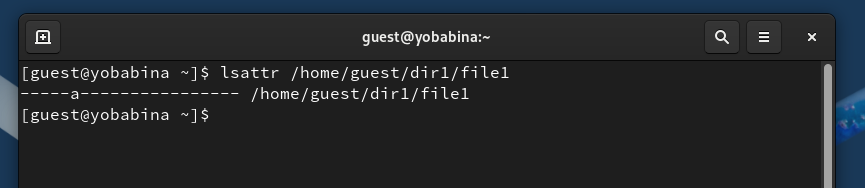
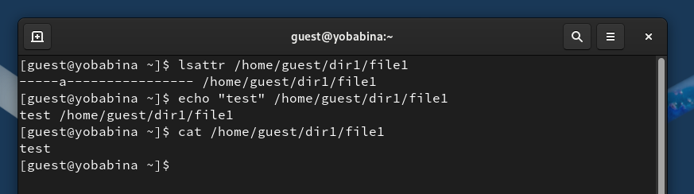
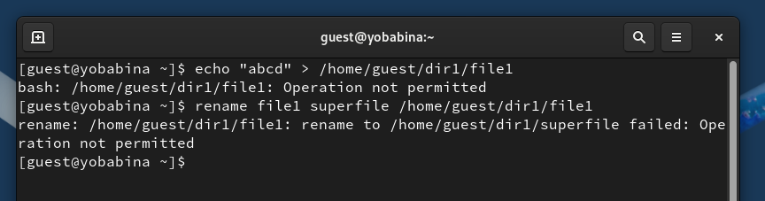
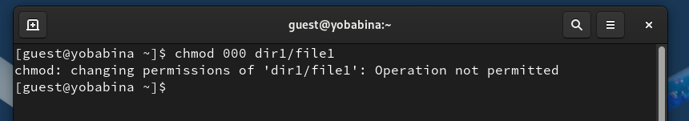
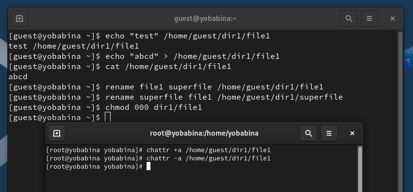
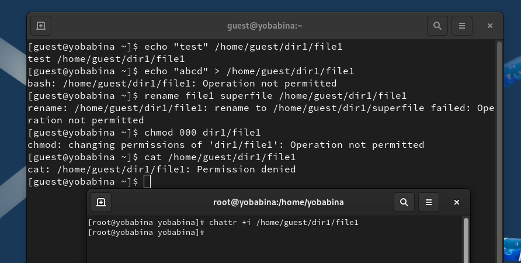

---
## Front matter
lang: ru-RU
title: Презентация к лабораторной работе №4
author: Бабина Ю.О.
group: НПМбд-02-21

## Formatting
toc: false
slide_level: 2
theme: metropolis
header-includes: 
 - \metroset{progressbar=frametitle,sectionpage=progressbar,numbering=fraction}
 - '\makeatletter'
 - '\beamer@ignorenonframefalse'
 - '\makeatother'
aspectratio: 43
section-titles: true
---

# Презентация к лабораторной работе №4

# Цель работы
Получение практических навыков работы в консоли с расширенными атрибутами файлов.

# Выполнение работы

## Определение расширенных атрибутов файла /home/guest/dir1/file1 

## Изменение прав доступа, разрешающие чтение и запись для владельца файла

## Установка расширенных атрибутов файла

 

## Установка расширенных атрибутов файла и их проверка

 

## Дозапись в файл

 

## Перезапись и переименование файла

 

## Попытка изменения прав доступа файла

## Снятие расширенных атрибутов файла и повторение операций

## Повторение операций при других правах доступа

# Вывод
## В рамках выполнения данной лабораторной работы я получила практические навыки работы в консоли с расширенными атрибутами файлов.
