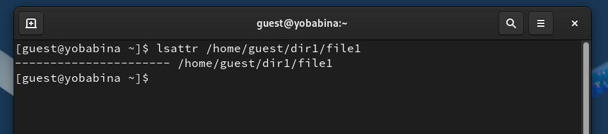
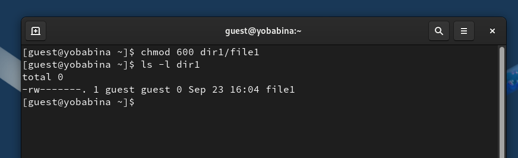
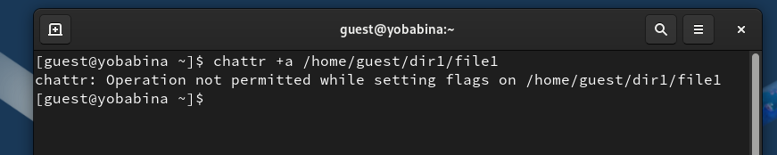
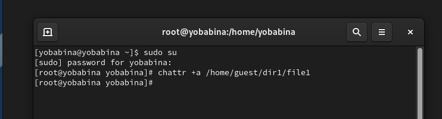
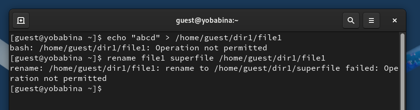
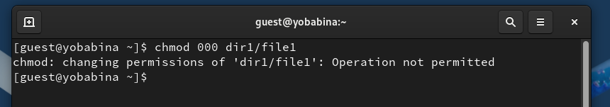

# **Отчет к лабораторной работе №4**
## **Common information**
discipline: Основы информационной безопасности  
group: НПМбд-02-21  
author: Бабина Ю. О.
---
---
## **Цель работы**
Получение практических навыков работы в консоли с расширенными атрибутами файлов.

## **Выполнение работы**

От имени пользователя guest определим расширенные атрибуты файла /home/guest/dir1/file1 командой:
"lsattr /home/guest/dir1/file1".

Установим командой: "chmod 600 file1"
на файл file1 права, разрешающие чтение и запись для владельца файла:

Попробуем установить на файл /home/guest/dir1/file1 расширенный атрибут a от имени пользователя guest с помощью команды:
"chattr +a /home/guest/dir1/file1".

 

 В ответ мы получили отказ от выполнения данной операции.

 Повысим свои права с помощью команды "su". Попробуем установить расширенный атрибут a на файл /home/guest/dir1/file1 от имени суперпользователя, с помощью команды: "chattr +a /home/guest/dir1/file1".

 

 От пользователя guest проверим правильность установления атрибута: "lsattr /home/guest/dir1/file1".

 

 Выполним дозапись в файл file1 слова «test» командой:
"echo "test" /home/guest/dir1/file1"

После этого выполним чтение файла file1 командой:
"cat /home/guest/dir1/file1"

 

Попробуем удалить файл file1, либо стереть имеющуюся в нём информацию командой:
"echo "abcd" > /home/guest/dirl/file1".

Попробуем переименовать файл:
 
 

Попробуем с помощью команды: "chmod 000 file1"
установить на файл file1 права, например, запрещающие чтение и запись для владельца файла.

Как видно, при выполнении вышеупомянутых команд нам было отказано в доступе.

Снимем расширенный атрибут a с файла /home/guest/dirl/file1 от имени суперпользователя командой:
"chattr -a /home/guest/dir1/file1".

Повторим операции, которые нам не удалось выполнить:

Как видно, все опрерации выполнить удалось.

Повторим наши действия по шагам, заменив атрибут «a» атрибутом «i».

Как видно, в большинстве операций нам было отказано.

## **Вывод**
В рамках выполнения данной лабораторной работы я получила практические навыки работы в консоли с расширенными атрибутами файлов.

## **Список литературы** ##
* https://translated.turbopages.org/proxy_u/en-ru.ru.64f0f2ee-66f17a93-e49e85ad-74722d776562/https/www.baeldung.com/linux/lsattr-chattr-attributes
* https://manpages.ubuntu.com/manpages/bionic/man1/chattr.1.html
* https://losst.pro/gruppy-polzovatelej-linux
* https://rockylinux.org/