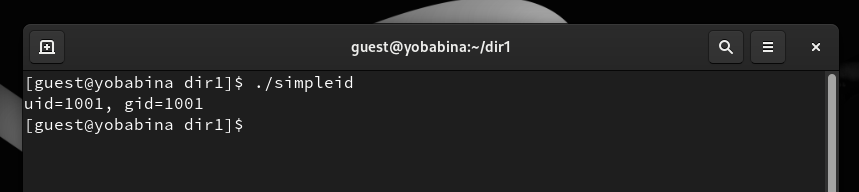

---
## Front matter
lang: ru-RU
title: Презентация к лабораторной работе №5
author: Бабина Ю.О.
group: НПМбд-02-21

## Formatting
toc: false
slide_level: 2
theme: metropolis
header-includes: 
 - \metroset{progressbar=frametitle,sectionpage=progressbar,numbering=fraction}
 - '\makeatletter'
 - '\beamer@ignorenonframefalse'
 - '\makeatother'
aspectratio: 43
section-titles: true
---

# Презентация к лабораторной работе №5

# Цель работы
Изучение механизмов изменения идентификаторов, применения
SetUID- и Sticky-битов. 
Получение практических навыков работы в консоли с дополнительными атрибутами. Рассмотрение работы механизма
смены идентификатора процессов пользователей, а также влияние бита
Sticky на запись и удаление файлов.

# Выполнение работы

## Вход под пользователем guest

## Программа simpleid.c

## Компиляция, выполнение и команда id

## Установка расширенных атрибутов файла и их проверка

 

## Программа simpleid2.c

## Процесс компиляции и запуск программы

## Изменение прав доступа к файлу и запуск программы

## Добавление SetGID-бита

## Программа readfile.c

## Компиляция

## Изменение прав доступа к файлу

## Добалвение SetUID-бит

## Чтение файлов

## Sticky-бит

## Файл file01.txt

## Предоставление прав доступа

## Другие операции с файлом 

## Снятие Sticky-бита

## Повторение команд

## Возвращение Sticky-бита

# Вывод
## 
В рамках выполнения данной лабораторной работы я изучила механизмы изменения идентификаторов, применения SetUID- и Sticky-битов.

Получила практические навыки работы в консоли с дополнительными атрибутами.

 Рассмотрела работы механизма смены идентификатора процессов пользователей, а также влияние бита
Sticky на запись и удаление файлов.
