# **Отчет к лабораторной работе №5**
## **Common information**
discipline: Основы информационной безопасности  
group: НПМбд-02-21  
author: Бабина Ю. О.
---
---
## **Цель работы**
Изучение механизмов изменения идентификаторов, применения
SetUID- и Sticky-битов. 
Получение практических навыков работы в консоли с дополнительными атрибутами. Рассмотрение работы механизма
смены идентификатора процессов пользователей, а также влияние бита
Sticky на запись и удаление файлов.

## **Выполнение работы**

Войдем в систему от имени пользователя guest.

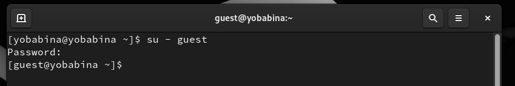

Создадим программу simpleid.c: 

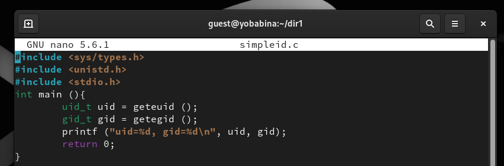

Скомплилируем программу и убедимся, что файл программы создан:

Выполним программу simpleid и системную программу id:

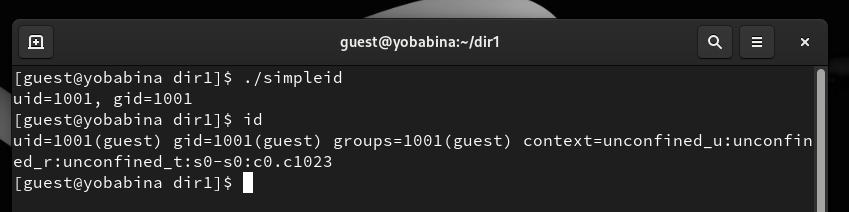

Усложним программу, добавив вывод действительных идентификаторов. Далее получившуюся программу назовем simpleid2.c.

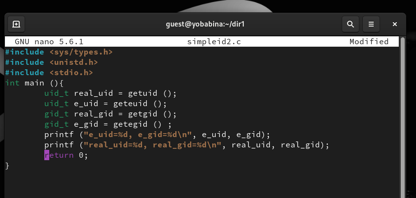

Скомпилируем и запустим simpleid2.c:

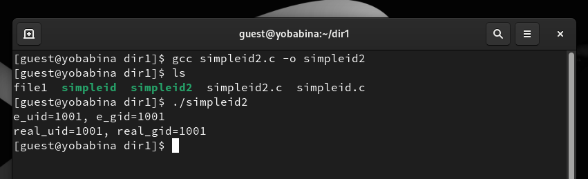

От имени суперпользователя выполним команды:
"chown root:guest /home/guest/simpleid2" и 
"chmod u+s /home/guest/simpleid2". Выполним проверку правильности установки новых атрибутов и смены владельца файла simpleid2:

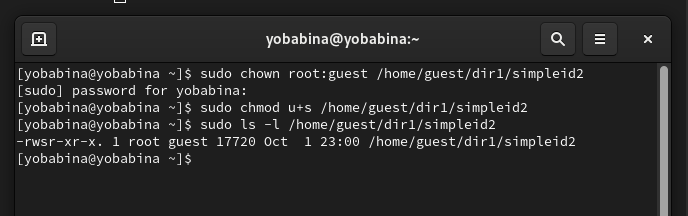

Запустим simpleid2 и id:

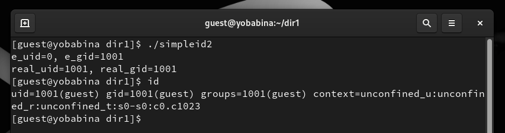

Проделаем тоже самое относительно SetGID-бита:

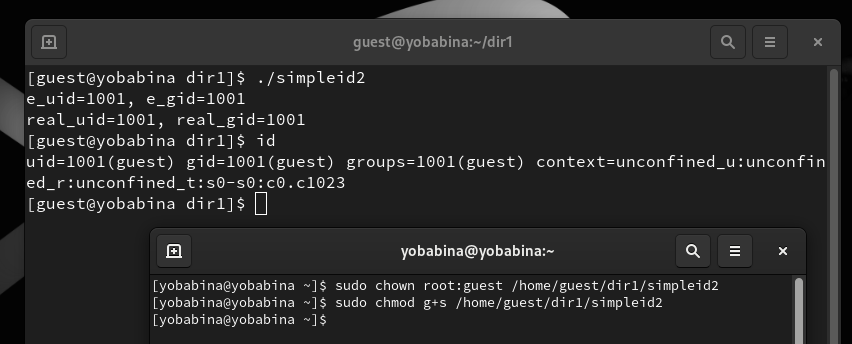

Создадим программу readfile.c:

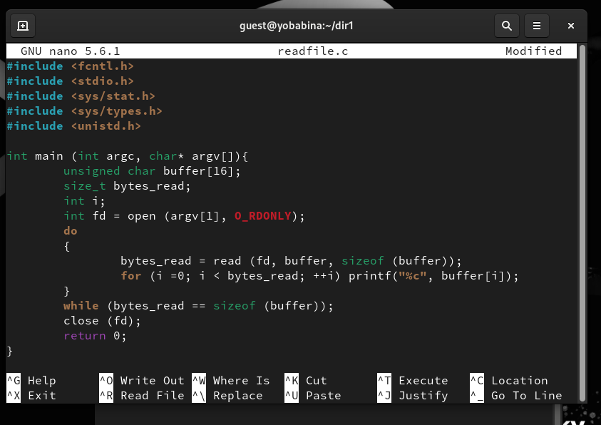

Откомпилируем её с помощью команды: "gcc readfile.c -o readfile":

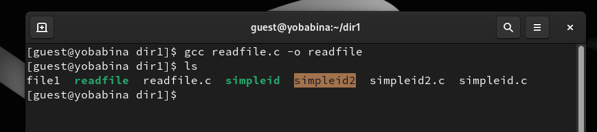

Сменим владельца у файла readfile.c (или любого другого текстового
файла в системе) и изменим права так, чтобы только суперпользователь
(root) мог прочитать его, a guest не мог:

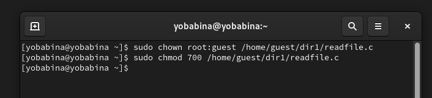

Проверим, что пользователь guest не может прочитать файл readfile.c. Далее сменим у программы readfile владельца и установим SetUID-бит.

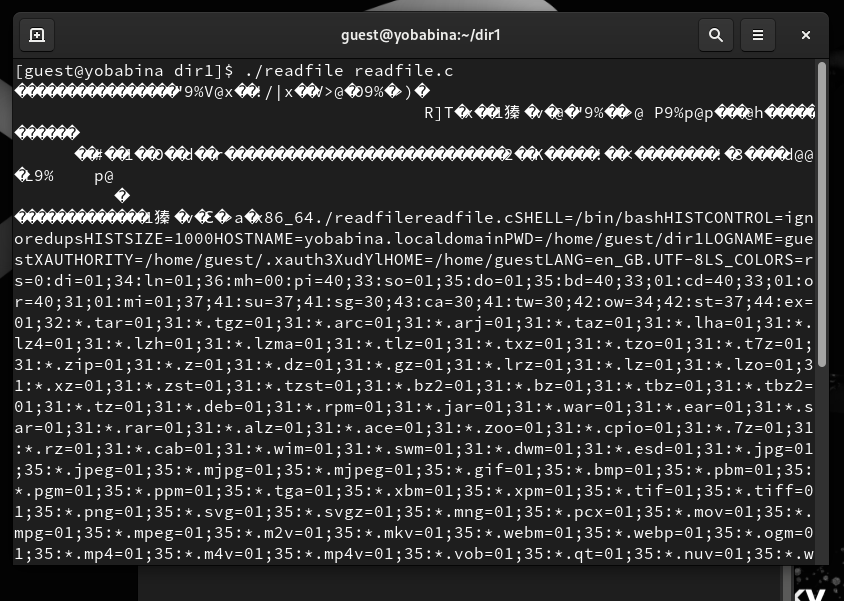

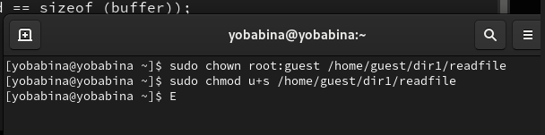

Проверим, может ли программа readfile прочитать файл readfile.c:

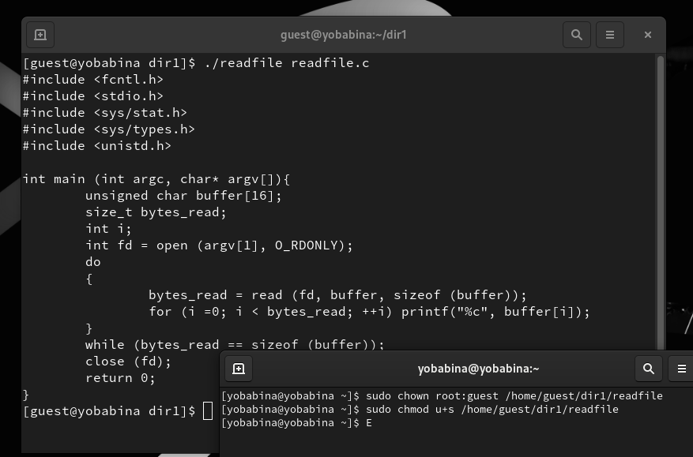

Проверим, может ли программа readfile прочитать файл /etc/shadow:

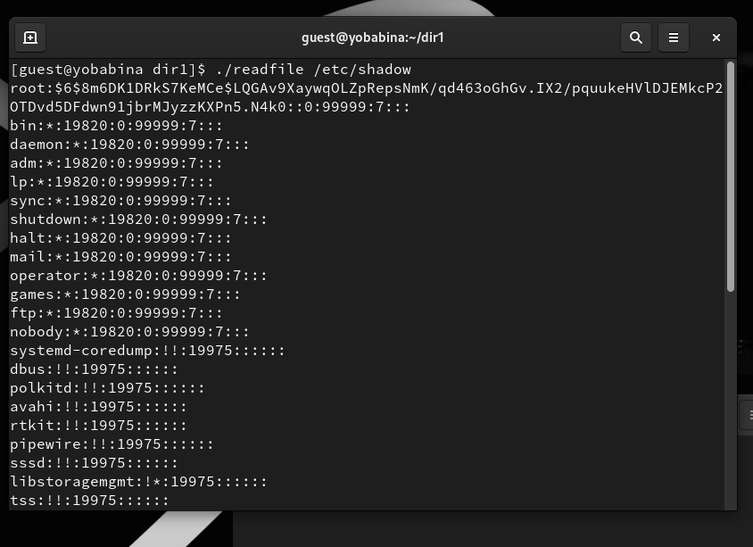

Выясним, установлен ли атрибут Sticky на директории /tmp, для этого выполним команду:
"ls -l / | grep tmp".

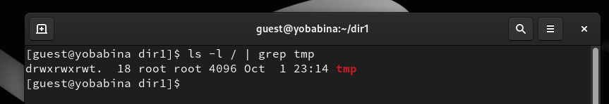

От имени пользователя guest создадим файл file01.txt в директории /tmp со словом test с помощью команды: "echo "test" > /tmp/file01.txt":

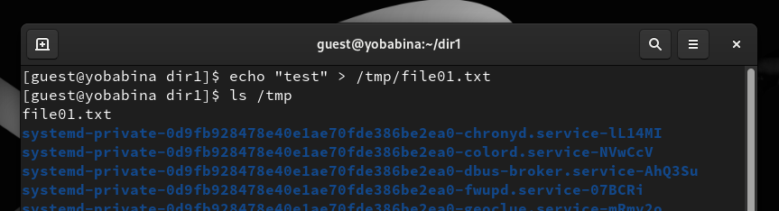

Просмотрим атрибуты у только что созданного файла и разрешим чтение и запись для категории пользователей «все остальные»:

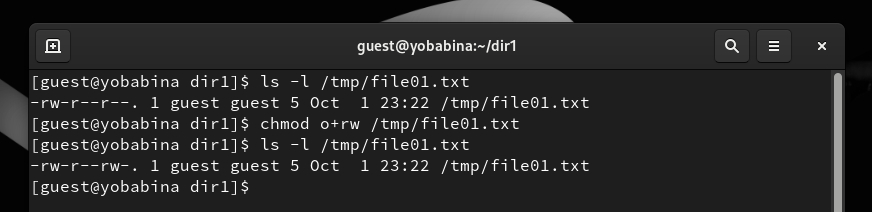

От пользователя guest2 (не являющегося владельцем) попробуем прочитать файл /tmp/file01.txt с помощью команды:"cat /tmp/file01.txt":

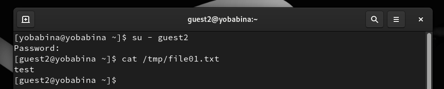

Далее от пользователя guest2 попробуем дозаписать в файл /tmp/file01.txt слово test2:

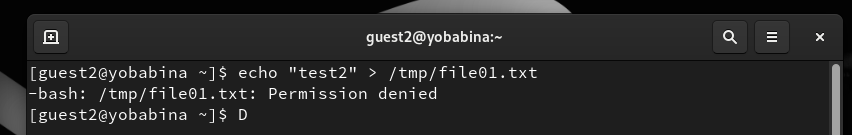

Проверим содержимое файла командой: "cat /tmp/file01.txt":

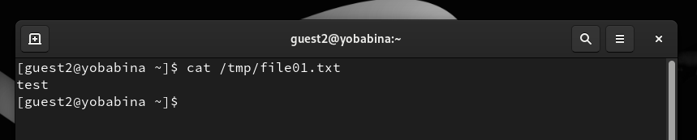

Также попробуем записать в файл /tmp/file01.txt
слово test3, стерев при этом всю имеющуюся в файле информацию:

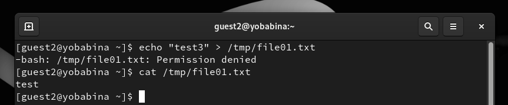

От пользователя guest2 попробуем удалить файл /tmp/file01.txt:

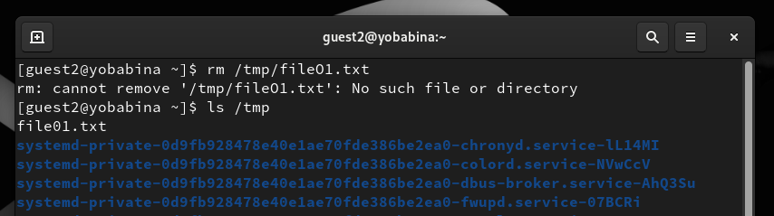

Повысим свои права до суперпользователя и выполним после этого команду, снимающую атрибут t (Sticky-бит) с директории /tmp. Далее покинем режим суперпользователя:

От пользователя guest2 проверим, что атрибута t у директории /tmp нет. Далее повторим предыдущие шаги:

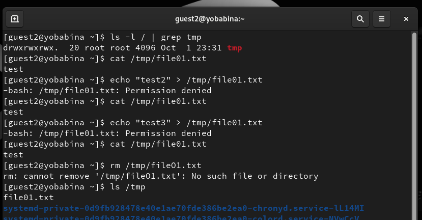

Повысим свои права до суперпользователя и вернем атрибут t на директорию /tmp:

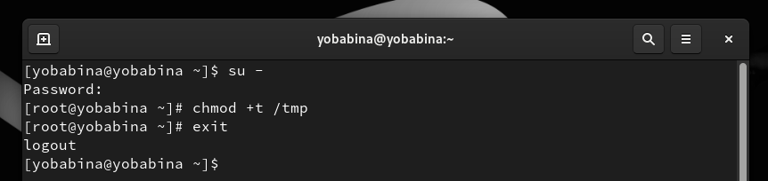

## **Вывод**
В рамках выполнения данной лабораторной работы я изучила механизмы изменения идентификаторов, применения SetUID- и Sticky-битов.

Получила практические навыки работы в консоли с дополнительными атрибутами.

 Рассмотрела работы механизма смены идентификатора процессов пользователей, а также влияние бита
Sticky на запись и удаление файлов.

## **Список литературы** ##
* https://habr.com/ru/articles/469667/
* https://www.golinuxcloud.com/sticky-bit-linux/
* https://rockylinux.org/