---
## Front matter
lang: ru-RU
title: Презентация к лабораторной работе №6
author: Бабина Ю.О.
group: НПМбд-02-21

## Formatting
toc: false
slide_level: 2
theme: metropolis
header-includes: 
 - \metroset{progressbar=frametitle,sectionpage=progressbar,numbering=fraction}
 - '\makeatletter'
 - '\beamer@ignorenonframefalse'
 - '\makeatother'
aspectratio: 43
section-titles: true
---

# Презентация к лабораторной работе №6

# Цель работы

Развить навыки администрирования ОС Linux. Получить первое практическое знакомство с технологией SELinux1.

Проверить работу SELinx на практике совместно с веб-сервером
Apache.

# Выполнение работы

## Команды getenforce и seastatus

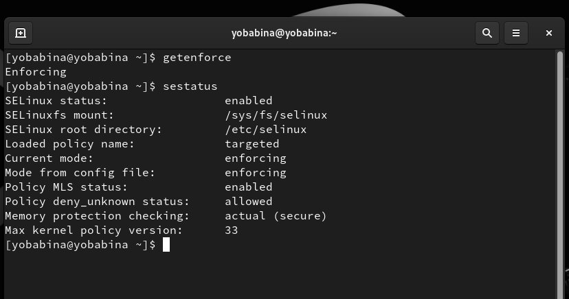

 ## Запуск сервиса Apache2

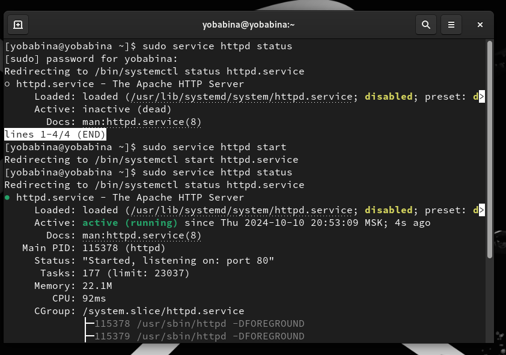

## Контекст безопасности Apache2

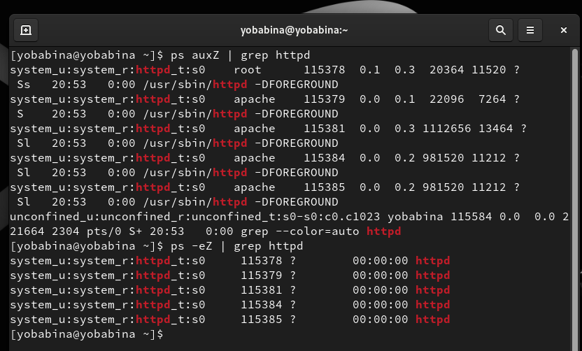

 ## Текущее состояние переключателей для Apache2

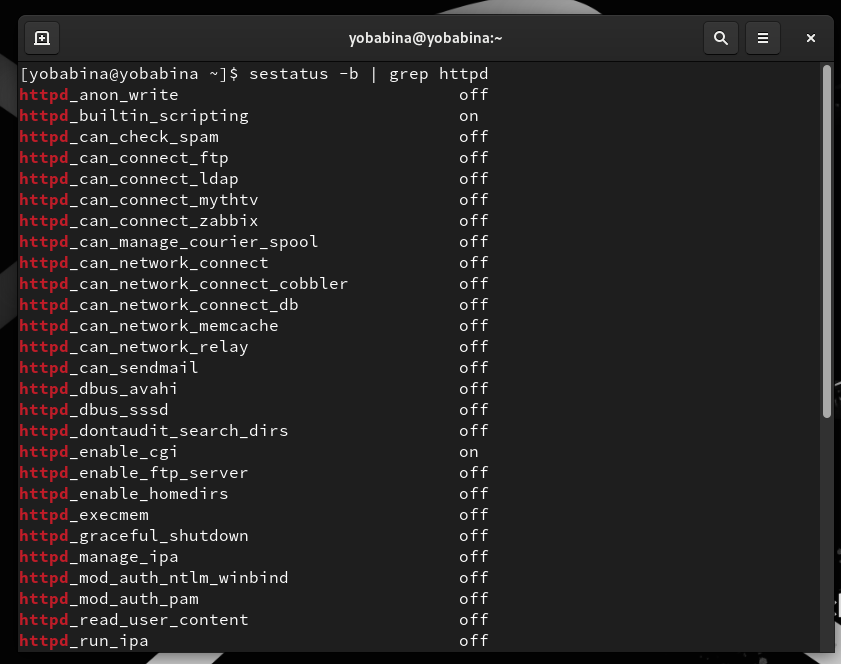

## Команда seinfo

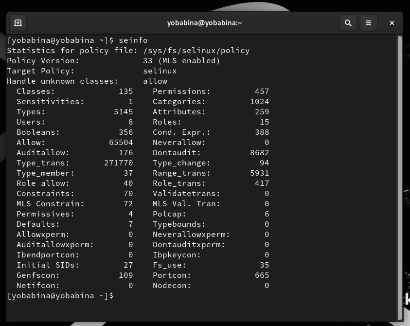

## Тип файлов и поддиректорий

## Файл test.html

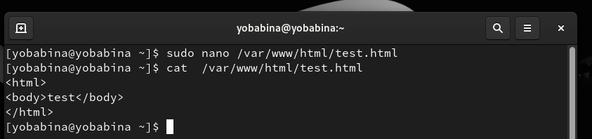

## Контекст файла

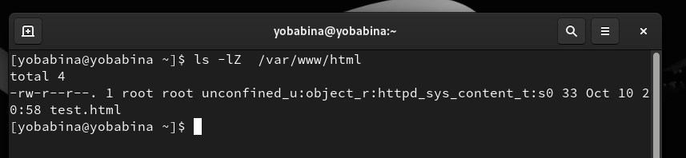

## Обращение к веб-серверу

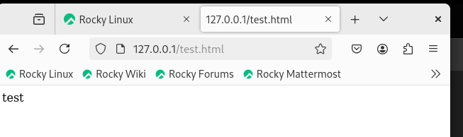

## Контекст файла

 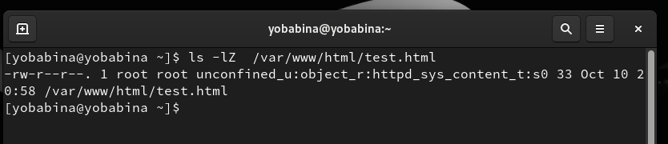

## Изменение контекста файла
 
 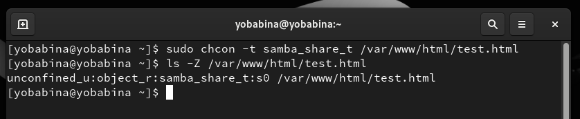
 
 ## Повторное обращение к веб-серверу

 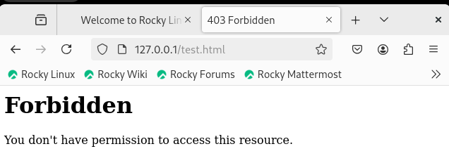

## Просмотр логов

 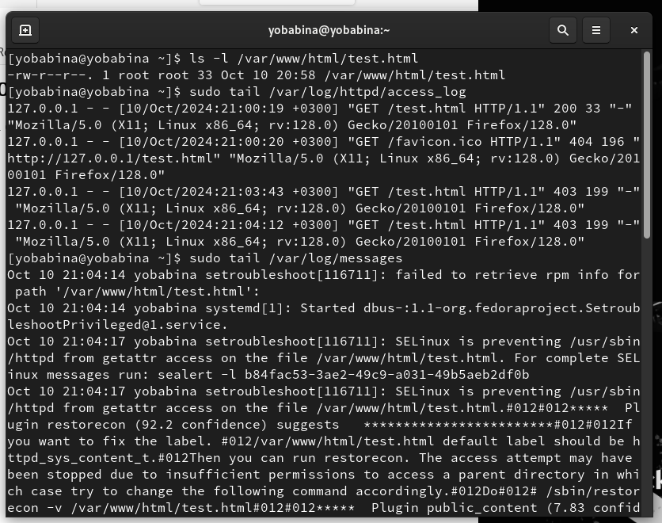
 
 ## Изменение прослушиваемого порта
 
 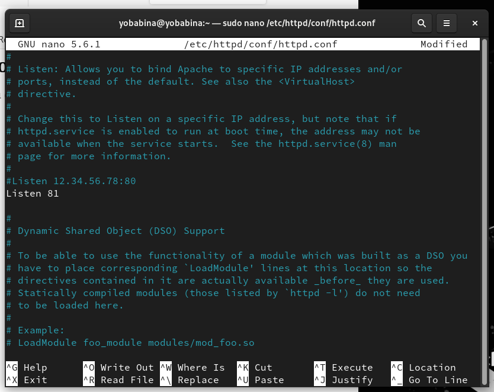
 
 ## Перезапуск Apache2

 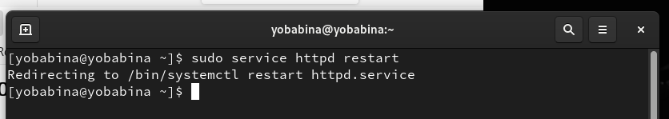
 
 ## Анализ логов

 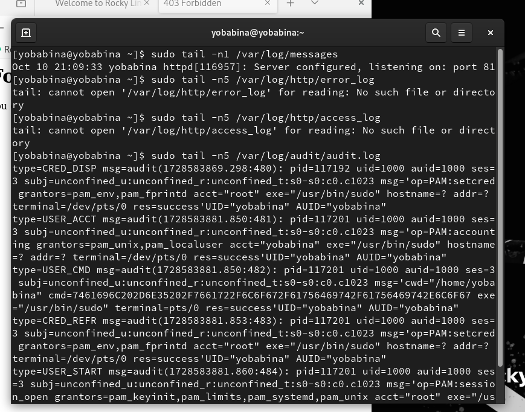
 
 ## Просмотр доступных портов

 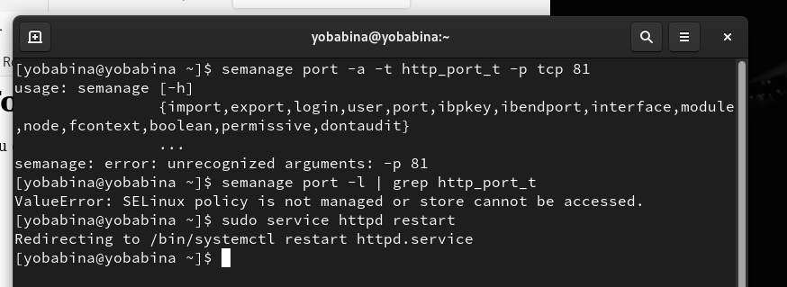

 ## Контекст файла

 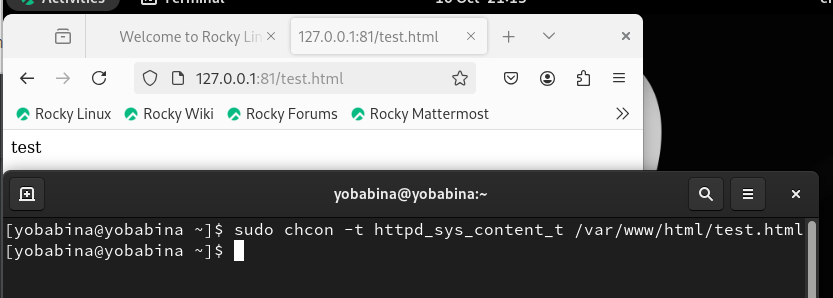
 
 ## Изменение конфигурационного файла  Apache2

 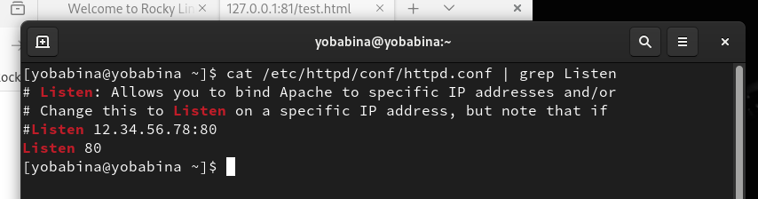
 
 ## Удаление привязки к порту и файла

 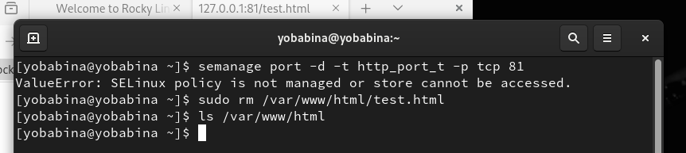
 
# Вывод
## 
В рамках выполнения данной лабораторной работы я развила навыки администрирования ОС Linux. Получила первое практическое знакомство с технологией SELinux1.

Проверила работу SELinx на практике совместно с веб-сервером
Apache.