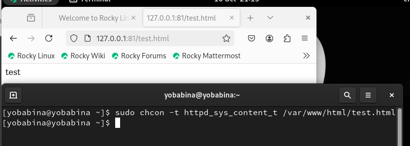
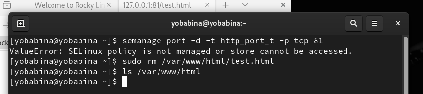

# **Отчет к лабораторной работе №6**
## **Common information**
discipline: Основы информационной безопасности  
group: НПМбд-02-21  
author: Бабина Ю. О.
---
---
## **Цель работы**
Развить навыки администрирования ОС Linux. Получить первое практическое знакомство с технологией SELinux1.

Проверить работу SELinx на практике совместно с веб-сервером
Apache.
## **Выполнение работы**

Войдем в систему с полученными учётными данными и убедимся, что SELinux работает в режиме enforcing политики targeted с помощью команд getenforce и sestatus.


Обратимся с помощью браузера к веб-серверу, запущенному на нашем компьютере, и убедимся, что последний работает


Найдем веб-сервер Apache в списке процессов, определим его контекст безопасности:


Посмотрим текущее состояние переключателей SELinux для Apache с
помощью команды:
"sestatus -bigrep httpd".


Посмотрим статистику по политике с помощью команды seinfo, также
определим множество пользователей, ролей, типов:


Определим тип файлов и поддиректорий, находящихся в директории /var/www, /var/www/html. Также определим 
круг пользователей, которым разрешено создание файлов в
директории /var/www/html.


Создадим от имени суперпользователя html-файл
/var/www/html/test.html:


Проверим контекст созданного файла:


Обратимся к файлу через веб-сервер, введя в браузере адрес
http://127.0.0.1/test.html.


 Изучим справку man httpd_selinux. Проверим контекст файла:

 

 Изменим контекст файла /var/www/html/test.html с
 httpd_sys_content_t на любой другой, к которому процесс httpd не должен иметь доступа, например, на samba_share_t:
 
 
 
 Попробуем ещё раз получить доступ к файлу через веб-сервер, введя в браузере адрес: "http://127.0.0.1/test.html":
 
 
 
 Просмотрим log-файлы веб-сервера Apache и системный лог-файл:
 
 
 
 Попробуем запустить веб-сервер Apache на прослушивание ТСР-порта
 81, для
 этого в файле /etc/httpd/httpd.conf найдем строчку Listen 80 и
 заменим её на Listen 81:
 
 
 
 Выполним перезапуск веб-сервера Apache:
 
 
 
 Проанализируем лог-файлы:
 
 
 
 Выполним команду
 ```
 semanage port -a -t http_port_t -р tcp 81
 ```
 После этого проверим список портов командой
 ```
 semanage port -l | grep http_port_t
 ```
 
 После чего попробуем запустить веб-сервер Apache ещё раз:
 
 
 
 Вернем контекст httpd_sys_cоntent__t к файлу /var/www/html/ test.html:
 
 
 
 Исправим конфигурационный файл apache, вернув Listen 80.
 
 
 
 Удалим привязку http_port_t к 81 порту. Затем удалим файл /var/www/html/test.html:
 
 
 


## **Вывод**
В рамках выполнения данной лабораторной работы я развила навыки администрирования ОС Linux. Получила первое практическое знакомство с технологией SELinux1.

Проверила работу SELinx на практике совместно с веб-сервером
Apache.

## **Список литературы** ##
* https://habr.com/ru/articles/469667/
* https://habr.com/ru/companies/kingservers/articles/209644/
* https://rockylinux.org/