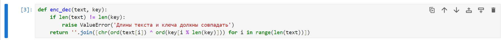
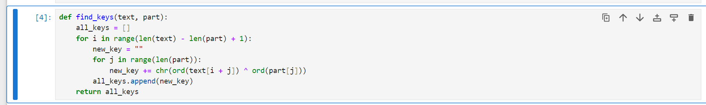
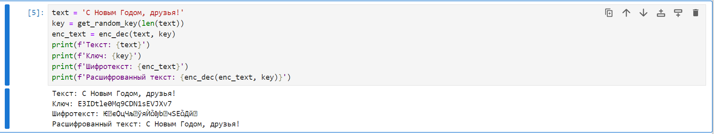
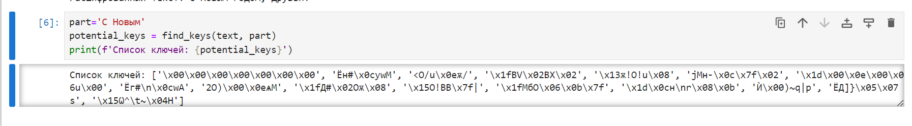

---
## Front matter
lang: ru-RU
title: Презентация к лабораторной работе №7
author: Бабина Ю.О.
group: НПМбд-02-21

## Formatting
toc: false
slide_level: 2
theme: metropolis
header-includes: 
 - \metroset{progressbar=frametitle,sectionpage=progressbar,numbering=fraction}
 - '\makeatletter'
 - '\beamer@ignorenonframefalse'
 - '\makeatother'
aspectratio: 43
section-titles: true
---

# Презентация к лабораторной работе №7

# Цель работы

Освоить на практике применение режима однократного гаммирования.

# Выполнение работы

## Импорт библиотек. Функция для генерации случайного ключа

## Функция шифрования / дешифрования. Функция find_possible_keys.

## Проверка корректности работы функций

# Вывод

В рамках выполнения данной лабораторной работы я освоила на практике применение режима однократного гаммирования.