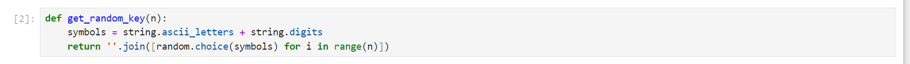
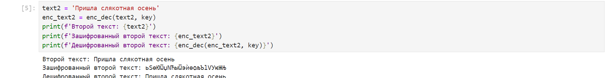

# **Отчет к лабораторной работе №8**
## **Common information**
discipline: Основы информационной безопасности  
group: НПМбд-02-21  
author: Бабина Ю. О.
---
---
## **Цель работы**

Освоить на практике применение режима однократного гаммирования
на примере кодирования различных исходных текстов одним ключом.

## **Выполнение работы**

Напишем код на языке программирования Python. Воспользуемся функциями из лабораторной работы №7 (для генерации ключа заданной длины и шифрования/дешифрования):





Возьмем два текста равной длины, сгенерируем для них один ключ, получим зашифрованные тексты и проверим корректность дешифрования:




Теперь получим потенциальный ключ для дешифрования текстов, применив посимвольно XOR (исключающее ИЛИ) для текстов. 

Теперь, получив ключ, мы можем применить его для расшифрования текстов. Особенность данного подхода в том, что в силу опреденности операции XOR применение нового ключа к первому шифротексту дает содержимое второго текста, а применение ко второму-первого.

  

В итоге имеем данную программу:

```Python
import random
import string

def get_random_key(n):
    symbols = string.ascii_letters + string.digits
    return ''.join([random.choice(symbols) for i in range(n)])

def enc_dec(text, key):
    if len(text) != len(key):
        raise ValueError('Длины текста и ключа должны совпадать')
    return ''.join([chr(ord(text[i]) ^ ord(key[i % len(key)])) for i in range(len(text))])

text1 = 'Пришла солнечная весна'
key = get_random_key(len(text1))
enc_text1 = enc_dec(text1, key)
print(f'Первый текст: {text1}')
print(f'Ключ: {key}')
print(f'Зашифрованный первый текст: {enc_text1}')
print(f'Дешифрованный первый текст: {enc_dec(enc_text1, key)}')

text2 = 'Пришла слякотная осень'
enc_text2 = enc_dec(text2, key)
print(f'Второй текст: {text2}')
print(f'Зашифрованный второй текст: {enc_text2}')
print(f'Дешифрованный второй текст: {enc_dec(enc_text2, key)}')

new_key = enc_dec(text1, text2)
print(f'Первый текст, расшифрованный с помощью нового ключа: {enc_dec(text2, new_key)}')
print(f'Второй текст, расшифрованный с помощью нового ключа: {enc_dec(text1, new_key)}')
```

## **Контрольные вопросы**

1) Для определения другого текста ($P_2$) можно просто взять зашифрованные тексты $C_1 ⊕ C_2$, далее применить XOR к ним и к известному тексту: $C_1 ⊕ C_2 ⊕ P_1 = P_2$.

2) При повторном использовании ключа мы получим дешифрованный текст.

3) Режим шифрования однократного гаммирования одним ключом двух открытых текстов осуществляется путем XOR-ирования каждого бита первого текста с соответствующим битом ключа или второго текста.

4) Недостатки шифрования одним ключом двух открытых текстов включают возможность раскрытия ключа или текстов при известном открытом тексте. 

5) Преимущества шифрования одним ключом двух открытых текстов включают использование одного ключа для зашифрования нескольких сообщений без необходимости создания нового ключа и выделения на него памяти.

## **Вывод**
В рамках выполнения данной лабораторной работы я освоила на практике применение режима однократного гаммирования
на примере кодирования различных исходных текстов одним ключом.

## **Список литературы** ##
* https://bugtraq.ru/library/books/crypto/chapter7/
* https://www.youtube.com/watch?v=tAjBULW_OjQ
* https://xakep.ru/2019/07/18/crypto-xor/