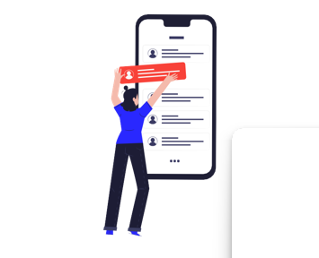

---
## Front matter
lang: ru-RU
title: Презентация
author: Бабина Ю.О.
group: НПМбд-02-21
marp: true
backgroundColor: #b2dfeb

## Formatting
toc: false
slide_level: 2
theme: metropolis
header-includes: 
 - \metroset{progressbar=frametitle,sectionpage=progressbar,numbering=fraction}
 - '\makeatletter'
 - '\beamer@ignorenonframefalse'
 - '\makeatother'
aspectratio: 43
section-titles: true

---

# Защита персональных данных в социальных сетях

Выполнила: Бабина Юлия НПМбд-02-21

---

**Цель работы**: рассмотреть проблему защиты персональных данных в социальных сетях и способы защиты.

**Задачи исследования**:
- Рассмотреть понятие персональных данных и их значение в современном мире.
- Изучить методы защиты личной информации в социальных сетях.
- Сформулировать рекомендации и наилучшие приемы для защиты персональных данных в социальных сетях.

---

# Введение

Тема защиты персональных данных в социальных сетях становится все более актуальной и важной для любого пользователя сети. Важно понимать, какие меры защиты применять, чтобы снизить риск кибератак и краж данных. Прежде всего, необходимо понять, что такое персональные данные, и что такое социальная сеть. 

---

# Закон о персональных данных

---

# Браузер. Режимы использования.

**Браузер** - программное обеспечение, которое позволяет выполнять запросы и просматривать веб-сайты.

Браузеры имеют несколько режимов использования:
* Основной режим
* Режим синхронизации браузера с аккаунтом
* Гостевой режим и режим инкогнито

---

# Социальная сеть. Предоставляемые документы.

**Социальная сеть** — интерактивный многопользовательский ресурс, содержание которого наполняется участниками сети. 

При регистрации социальная сеть предоставляет текст **Согласия на обработку персональных данных, Пользовательского соглашения и Политики конфиденциальности.**

---

# Рекомендации  для защиты персональных данных в социальных сетях

---

# Пароли

* Используйте разные пароли для разных сервисов.
* Придумывайте сложные пароли или пользуйтесь генераторами паролей.
* Не храните пароли в открытом виде.

---

# Электронная почта

* Заведите два адреса электронной почты: частный и публичный.
* Передавайте приватный адрес в переписке способом, непригодным для автоматического прочтения сборщиком адресов.

---

# Двухфакторная аутентификация

* Установите двухфакторную идентификацию с помощью дополнительного кода, направляемого в CMC-сообщении.

---

# Доступ к просмотру контента

* Настройте ваш профиль в социальной сети так, чтобы только друзья могли его просматривать. 

---

# Публикуемый контент

* Внимательно относитесь к информации, которую публикуете о себе в социальной сети. 
* Используйте никнейм.

---

# Публикуемый фото-контент

* Перед тем как выложить фотографию, оцените каждую деталь: свой внешний вид, окружающую местность, людей, находящихся рядом с вами, и многое другое. 

---

# Установка приложений

* Не устанавливайте приложения для соцсетей, которые позволяют отследить активность подписчиков на вашей странице.

---

# Отправка документов

* Не отправляйте важные документы через социальные сети и не публикуйте фотографии документов.

---

# Отправка денежных средств.

* Перепроверяйте сообщения от друзей с просьбой срочно выслать денег.

---

# Переход по незнакомым ссылкам.

* Проявляйте осторожность при переходе по ссылкам, полученным в сообщениях от других пользователей, если вы не знакомы с отправителем.

---

# Провокационные сообщения.

* Воздерживайтесь от ответа на провокационные сообщения и комментарии других пользователей.
* Блокируйте навязчивых провокаторов.

---

# Выход из аккаунта.

* При завершении работы в социальной сети выходите из своего аккаунта.

---
# Заключение

В моей работе были рассмотрены возможные способы защиты персональных данных в социальных сетях. Прежде всего, следует отметить, что пользователь сам должен понять, какая информация может быть опубликована, а какая нет. Мы должны публиковать как можно меньше личной информации, чтобы злоумышленники не могли использовать ее в своих целях. Современные социальные сети поддерживают огромный функционал, чтобы персональные данные не стали общедоступными.

---

# Список литературы

* Ищейнов В. Я. Персональные данные в законодательных и нормативных документах Российской Федерации и информационных системах.: Делопроизводство 2022

* Конституция Российской Федерации» (принята всенародным голосованием 12.12.1993) (с учетом поправок, внесенных Законами РФ о поправках к Конституции РФ от 30.12.2008 N 6-ФКЗ, от 30.12.2008 N 7-ФКЗ, от 05.02.2014 N 2-ФКЗ, от 21.07.2014 N 11-ФКЗ) https://corp.mail.ru/ru/press/infograph/9037/ 

* Буянов, Д. С. Информационная безопасность в социальных сетях / Д. С. Буянов. Молодой ученый. — 2018. — № 39 (225). — С. 14-16. — URL: https://moluch.ru/archive/225/52820/ (дата обращения: 28.09.2024).

---

# Спасибо за внимание!