---
## Front matter
lang: ru-RU
title: Презентация к 1 этапу индивидуального проекта
author: Бабина Ю.О.
group: НПМбд-02-21

## Formatting
toc: false
slide_level: 2
theme: metropolis
header-includes: 
 - \metroset{progressbar=frametitle,sectionpage=progressbar,numbering=fraction}
 - '\makeatletter'
 - '\beamer@ignorenonframefalse'
 - '\makeatother'
aspectratio: 43
section-titles: true
---

# Презентация к 1 этапу индивидуального проекта

# Цель работы
Цель работы: Приобретение практических навыков
установки операционной системы Kali Linux на виртуальную машину, настройки минимально необходимых для дальнейшей работы сервисов.

# Выполнение работы

## Создание виртуальной машины

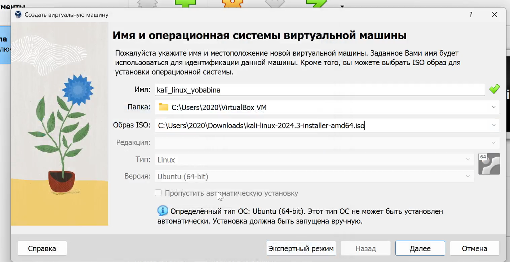

## Выбор объема основной памяти

## Настройка виртуального жесткого диска 

## Графическая установка
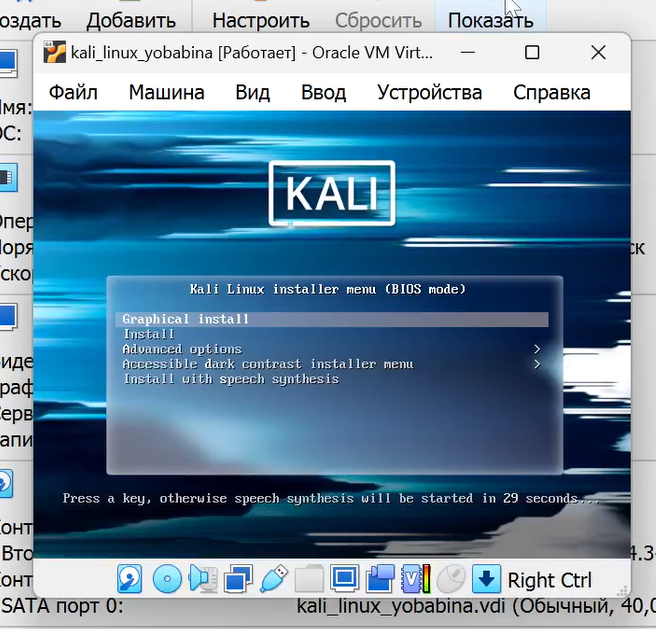

## Выбор языка, местонахождения, клавиатуры

## Сетевые настройки

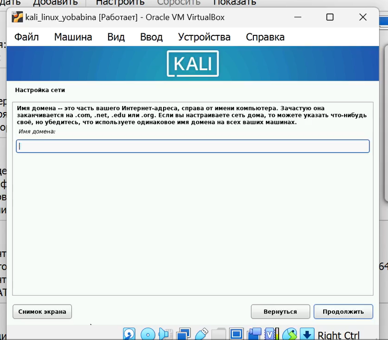

## Создание пользователя
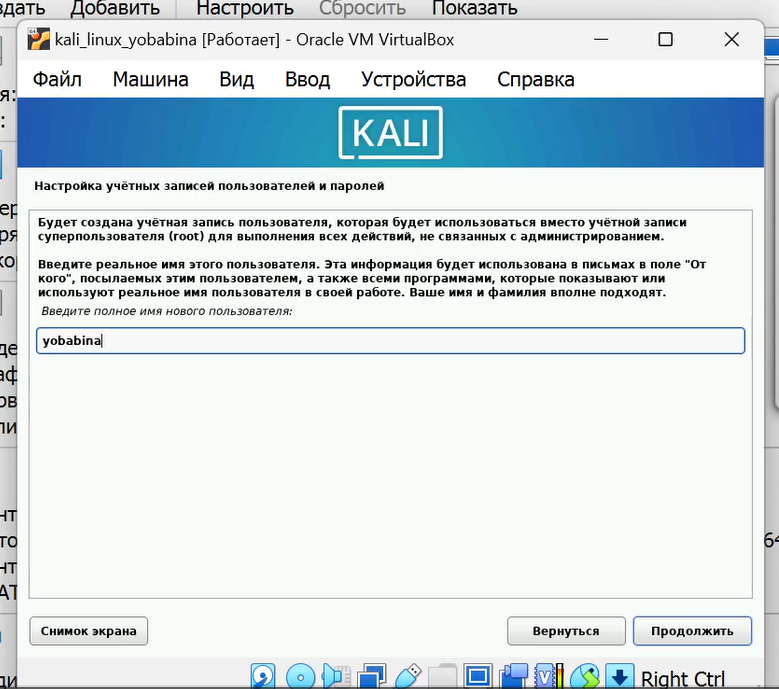

## Установка пароля

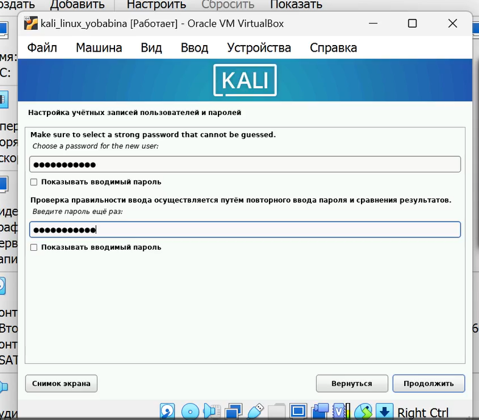

## Выбор часового пояса 

## Разметка диска

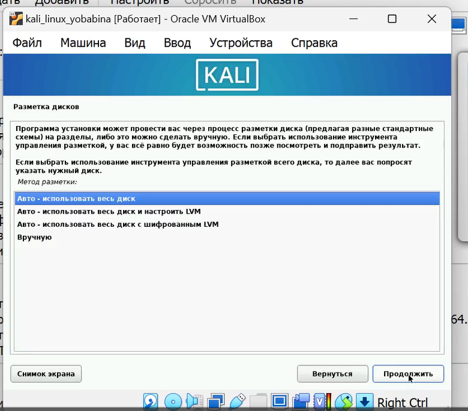

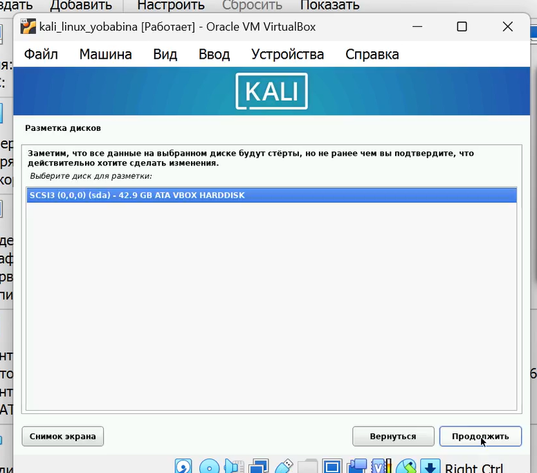

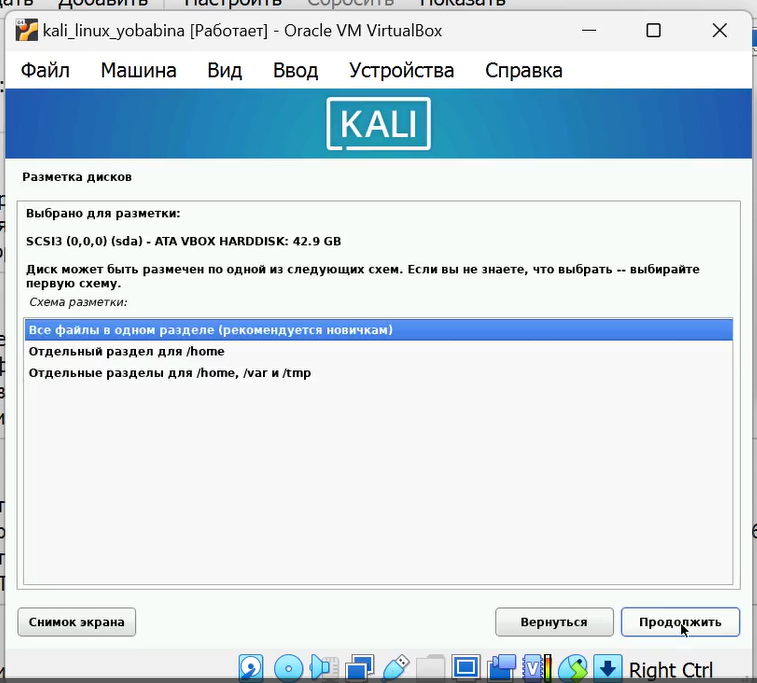

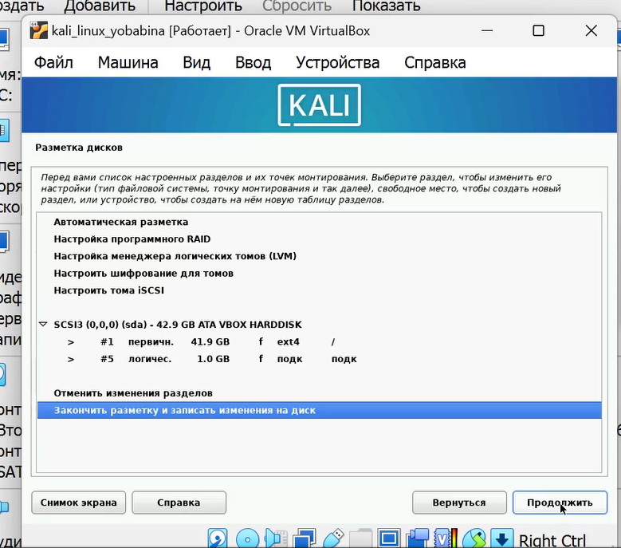

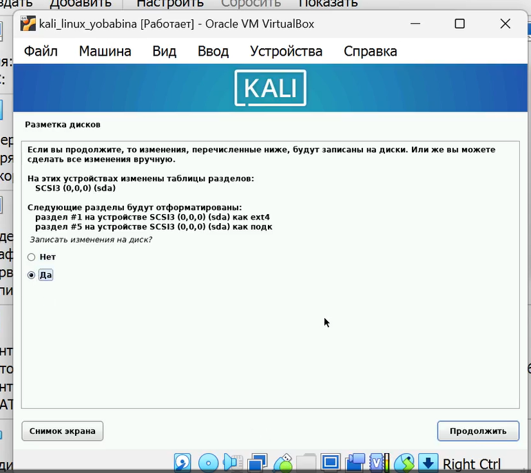

## Выбор программного обеспечения

## Системный загрузчик GRUB

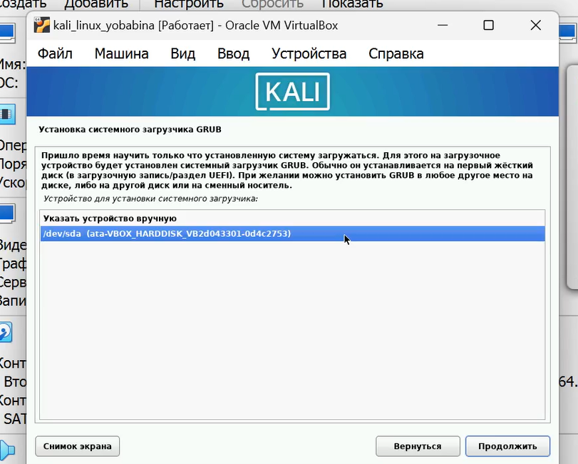
 
## Окончание установки и перезагрузка

## Вход в систему

# Вывод
## В рамках выполнения данной лабораторной работы я приобрела практический навык установки операционной системы Kali Linux на виртуальную машину и настройки минимально необходимых для дальнейшей работы сервисов.