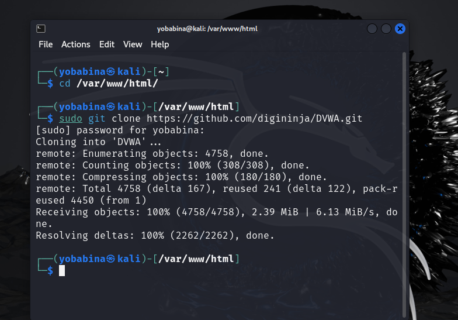
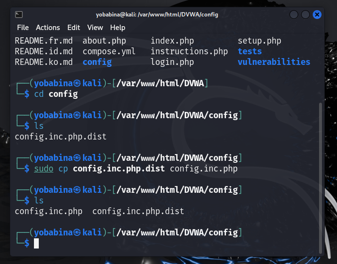
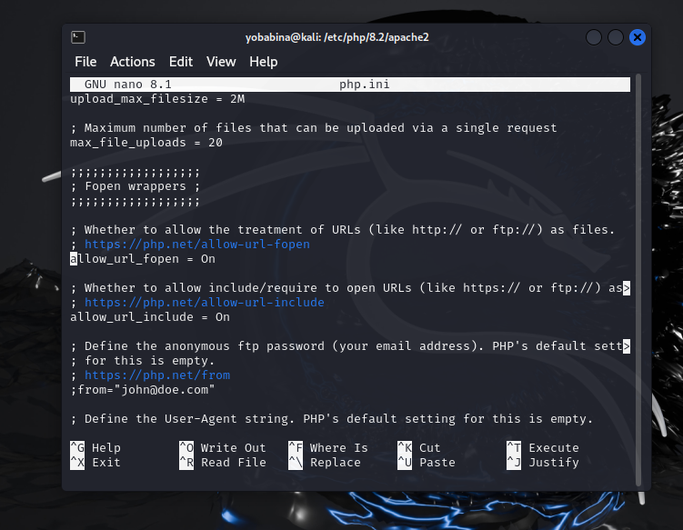
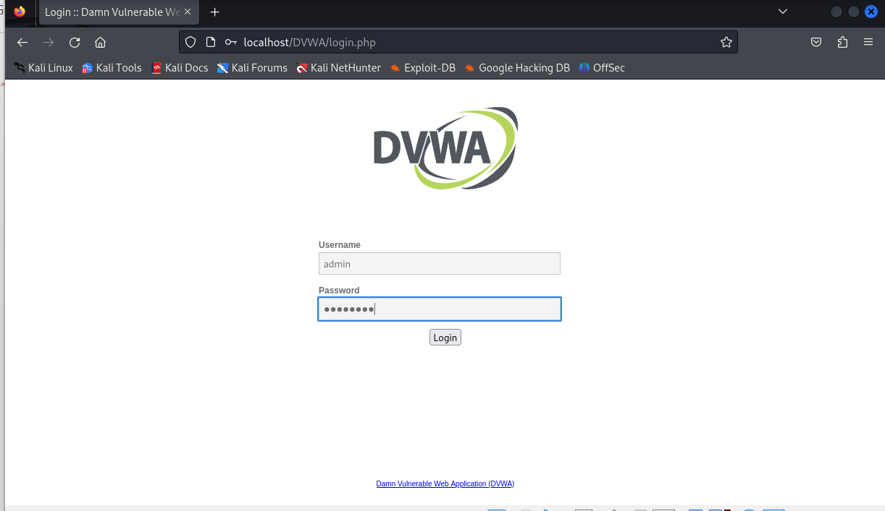

---
## Front matter
lang: ru-RU
title: Презентация ко 2 этапу индивидуального проекта
author: Бабина Ю.О.
group: НПМбд-02-21

## Formatting
toc: false
slide_level: 2
theme: metropolis
header-includes: 
 - \metroset{progressbar=frametitle,sectionpage=progressbar,numbering=fraction}
 - '\makeatletter'
 - '\beamer@ignorenonframefalse'
 - '\makeatother'
aspectratio: 43
section-titles: true
---

# Презентация к 2 этапу индивидуального проекта

# Цель работы

Цель работы: Приобретение практического навыка установки и развертывания веб-приложений DVWA в гостевую систему к Kali Linux.

# Выполнение работы

## Клонирование репозитория

## Копирование содержимого файла 

## Содержание файла config.inc.php

## Запуск сервера MySQL

## Создание базы данных и пользователя 

## Настройка и запуск веб-сервера apache2

!

## Форма авторизации 

## Применение миграций к базе данных

## Установленное приложение

# Вывод

## В рамках выполнения данной лабораторной работы я приобрела практический навык установки и развертывания веб-приложений DVWA в гостевую систему к Kali Linux.