# **Отчет ко 2 этапу индивидуального проекта**
## **Common information**
discipline: Основы информационной безопасности  
group: НПМбд-02-21  
author: Бабина Ю. О.
---
---
## **Цель работы**

Приобретение практического навыка установки и развертывания веб-приложений DVWA в гостевую систему к Kali Linux.

## **Выполнение работы**

Перейдем в директорию /var/www/html/ и склонируем репозиторий командой: "git clone https://github.com/digininja/DVWA.git"

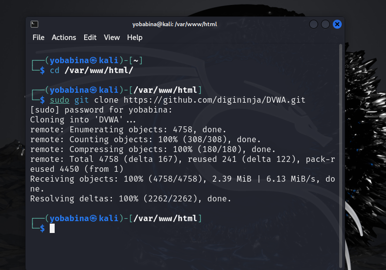

Перейдем в директорию config и скопируем содержимое файла config.inc.php.dist в файл config.inc.php командой: "cp config.inc.php.dist config.inc.php":

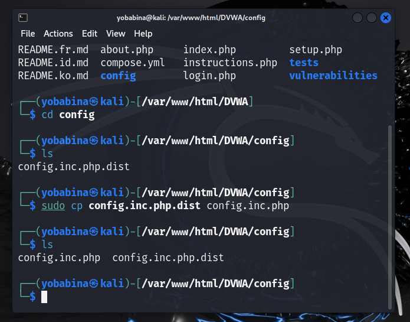

Откроем файл с помощью команды: "nano config.inc.php"

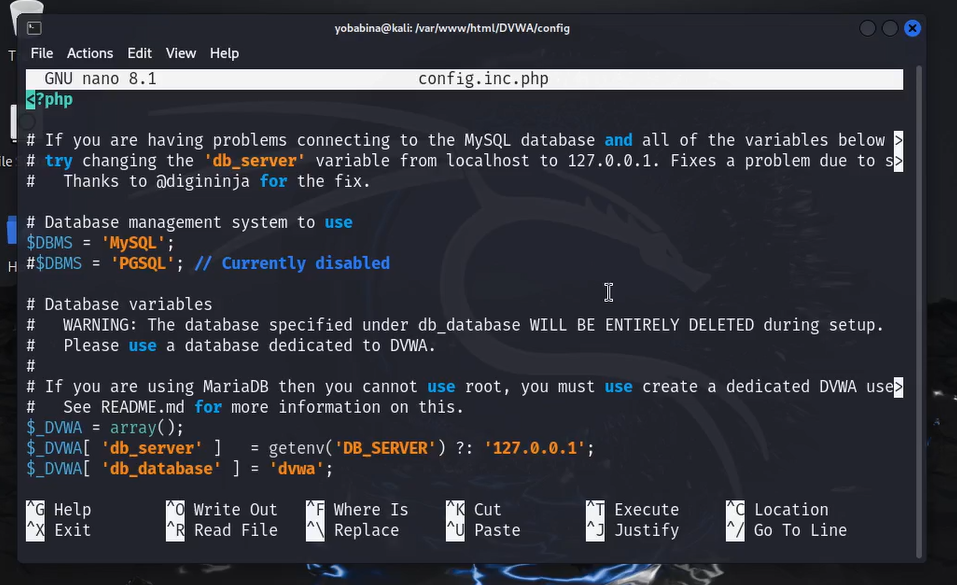

Как видим, файл содержит конфигурацию для подключения к СУБД MySQL, как к СУБД по умолчанию.

По умолчанию в Kali Linux установлена данная СУБД, значит, нам нужно лишь запустить процесс командой: "sudo service mysql start" и посмотреть статус работы  с помощью команды: "sudo service mysql status".

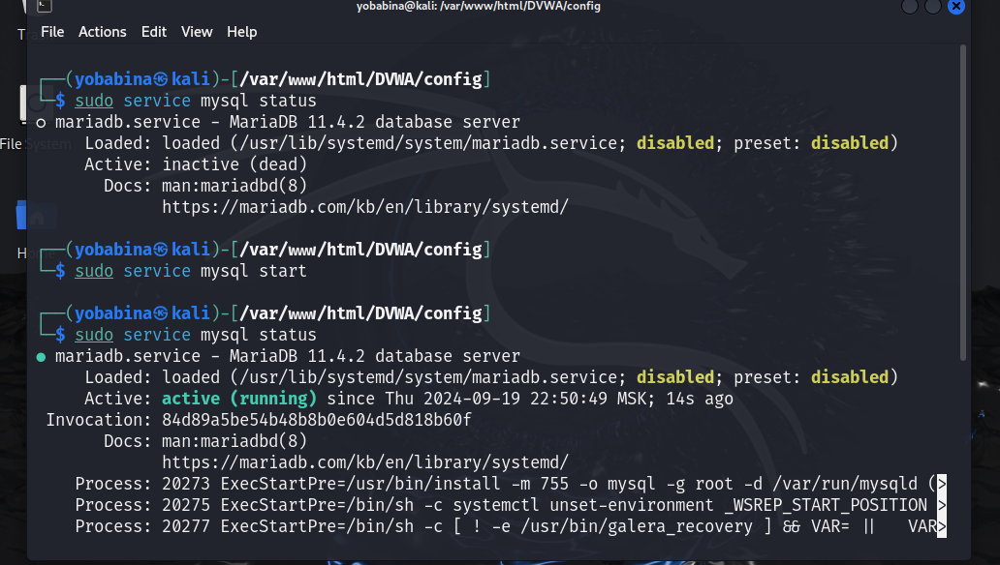

Теперь перейдем к созданию базы данных и пользователя в соответствии с файлом config.inc.php:

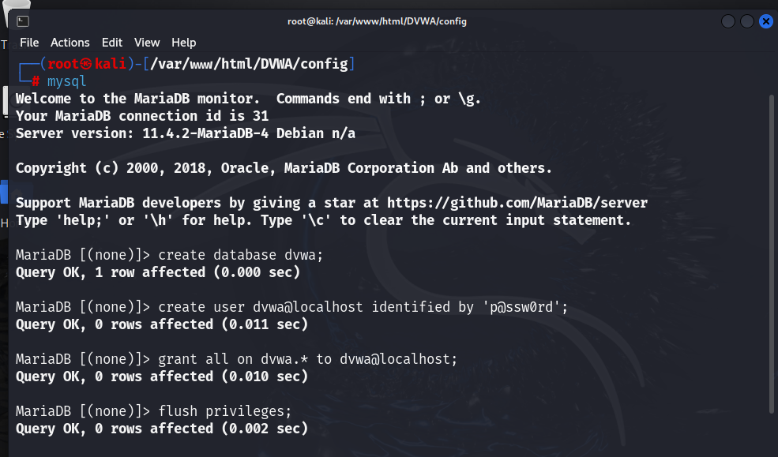

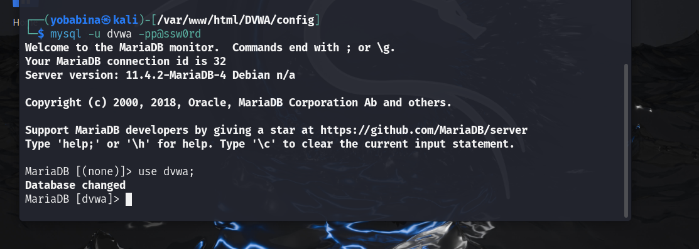

После мы должны внести изменения в конфигурационный файл php.ini веб-сервера apache2. 

Для корректной работы переменные allow_url_include и allow_url_fopen должны иметь значения On.

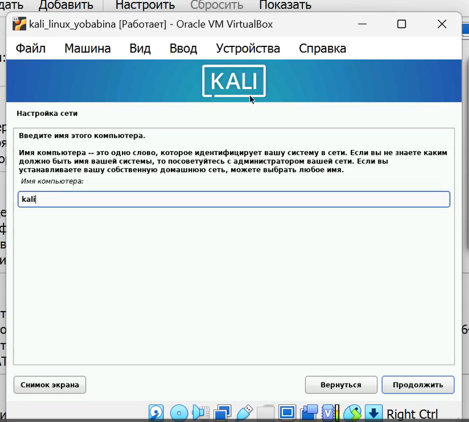

Запустим процесс веб-сервера аналогично MySQL:

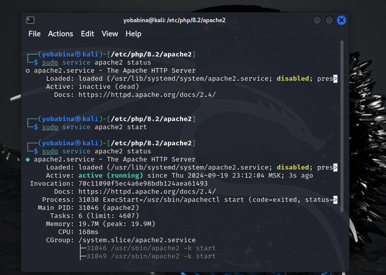

Теперь перейдем по адресу https://127.0.0.1/DVWA/login.php.

В форму авторизации введем имя пользователя-admin и пароль-password.

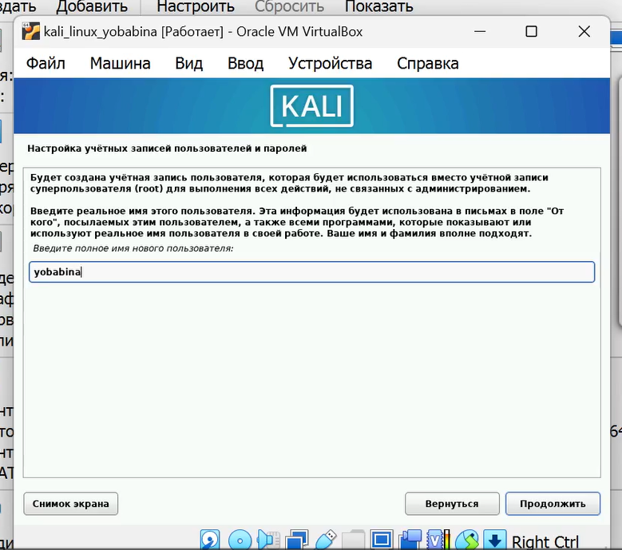

Перейдя на страницу приложения, прокрутим ее вниз до кнопки "Create / Reset Database" и нажмем на нее. После авторизуемся повторно: 

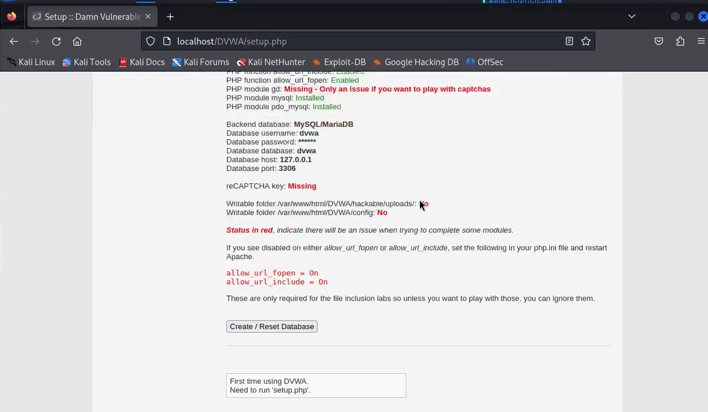

Итак, веб-приложение DVWA установлено.

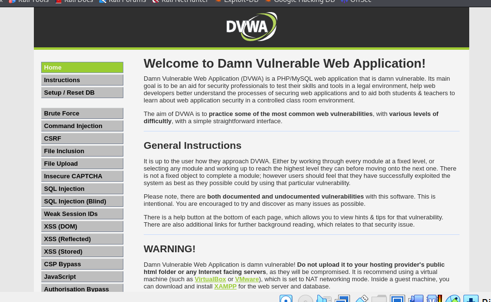

## Вывод
В рамках выполнения данной лабораторной работы я приобрела практический навык установки и развертывания веб-приложений DVWA в гостевую систему к Kali Linux.

## Список литературы ##
* https://www.kali.org/
* https://github.com/digininja/DVWA?tab=readme-ov-file 
* https://kali.tools/?p=1820