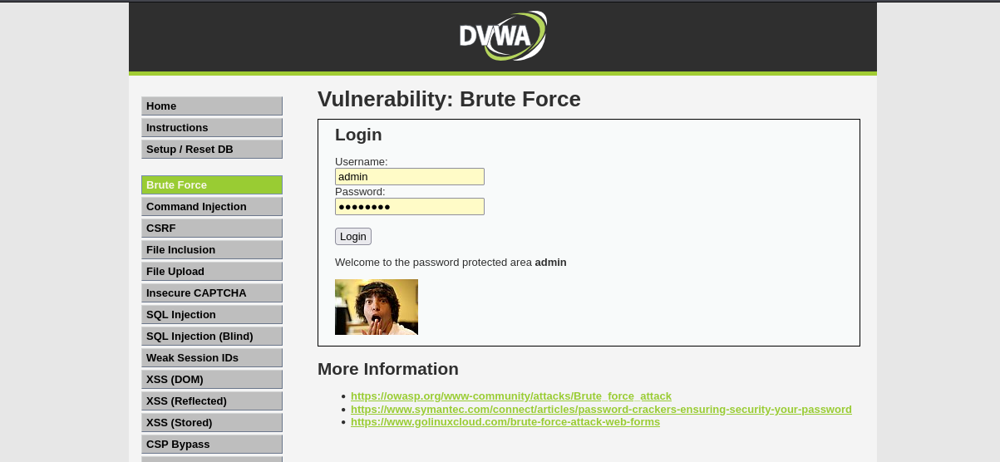

---
## Front matter
lang: ru-RU
title: Презентация к 3 этапу индивидуального проекта
author: Бабина Ю.О.
group: НПМбд-02-21

## Formatting
toc: false
slide_level: 2
theme: metropolis
header-includes: 
 - \metroset{progressbar=frametitle,sectionpage=progressbar,numbering=fraction}
 - '\makeatletter'
 - '\beamer@ignorenonframefalse'
 - '\makeatother'
aspectratio: 43
section-titles: true
---

# Презентация к 3 этапу индивидуального проекта

# Цель работы

Приобретение практических навыков по использованию Hydra для брутфорса паролей.

# Выполнение работы

## Запуск сервисов

## Содержащие пароли файлы

## Форма для брутфорса 

## Cookie-переменные

## Брутфорс формы при помощи hydra

## Успешная авторизация

# Вывод

## В рамках выполнения данной лабораторной работы я приобрела приобрела практический навык по использованию Hydra для брутфорса паролей.