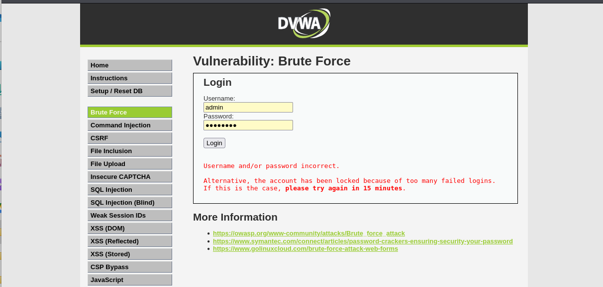
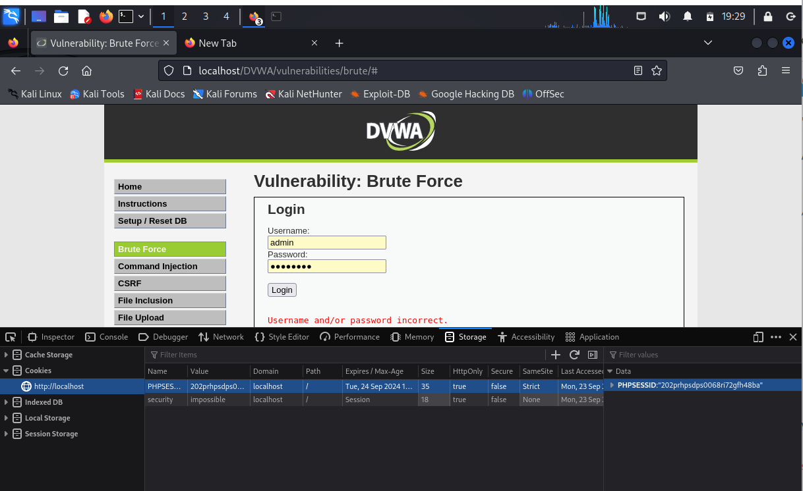
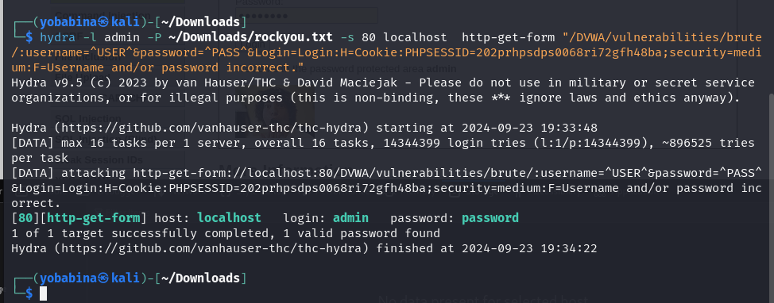

# **Отчет к 3  этапу индивидуального проекта**
## **Common information**
discipline: Основы информационной безопасности  
group: НПМбд-02-21  
author: Бабина Ю. О.
---
---
## **Цель работы**

Приобретение практических навыков по использованию Hydra для брутфорса паролей.

## **Выполнение работы**

Для перебора пароля нам нужен файл, содержащий пароли. Пример такого файла находится в директории /usr/share/wordlists/ в архиве rockyou.txt.gz.

Скопируем архив в директорию Downloads и разархивируем его:

Теперь в браузере откроем приложение DVWA, развернутое на прошлом этапе, предварительно запустив сервисы MySQL и Apache2:

Далее перейдем в форму для взлома. Она располагается в разделе Brute Force:

В форме имеются два html-тега input с атрибутами name, равными 'username' и 'password' соответственно.

Также нам могут пригодится фрагменты-cookie нашего приложения. У нас это PHPSESSID и security:

Теперь произведем брутфорс формы при помощи утилиты hydra: 
"hydra -l <login> -P <path_to_file> -s <port> <host> http-<method>-form "
<url>:username=^USER^&password=^PASS^&Login=Login:H=Cookie:<key=value>;
<key=value>:F=<error_message>" , где

* login - логин для авторизации (в нашем случае admin)
* path_to_file - путь до файла с паролями
(в нашем случае /home/yobabina/Downloads/rockyou.txt)
* port - порт, по которому доступно приложение (в нашем случае 80)
* host - домен или ip приложения (в нашем случае localhost)
* method - метод запроса (в нашем случае get)
* url - адрес относительно корня сайта
(в нашем случае /DVWA/vulnerabilities/brute/)
* key=value - имена и значения cookie-переменных
(в нашем случае PHPSESSID и security)
* error_message - сообщение, выводимое при неверных логине и пароле
(в нашем случае Username and/or password incorrect.)

В итоге команда имеет следующие опции:

"hydra -l admin -P ~/Downloads/rockyou.txt -s 80 localhost http-get-form
"/DVWA/vulnerabilities/brute/:username=^USER^&password=^PASS^&Login=Login:H=Cookie
:security=medium;PHPSESSID=h5f8987rvm2ior52h8kqktaf8g:F=Username and/or password
incorrect.""

Как видно, утилита подобрала подходящий пароль. 
Далее введем его в поле и успешно авторизуемся:

## Вывод
В рамках выполнения данной лабораторной работы я приобрела приобрела практический навык по использованию Hydra для брутфорса паролей.

## Список литературы ##
* https://www.kali.org/
* https://github.com/digininja/DVWA?tab=readme-ov-file 
* https://spy-soft.net/rockyou-txt/
* https://losst.pro/kak-polzovatsya-hydra#perebor-parolya-autentifikcii-http