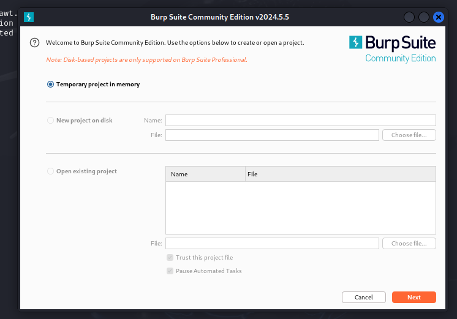
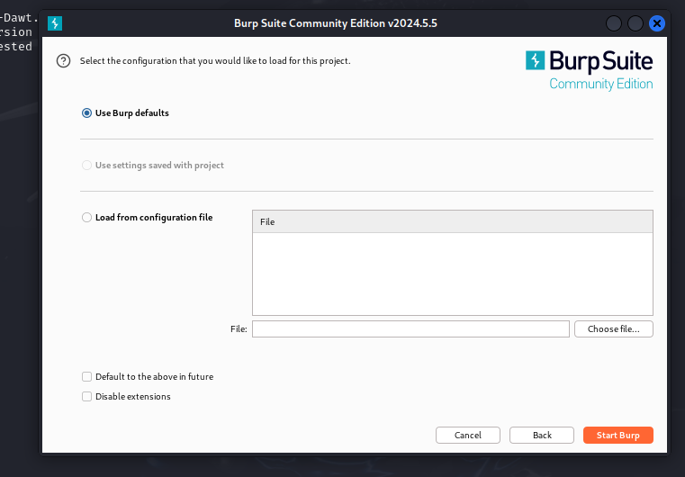
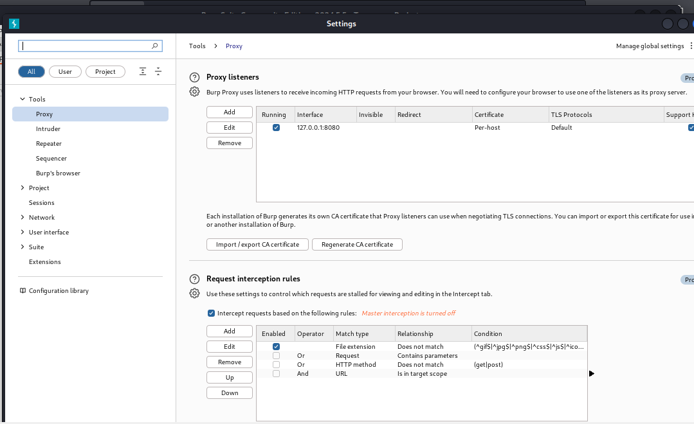
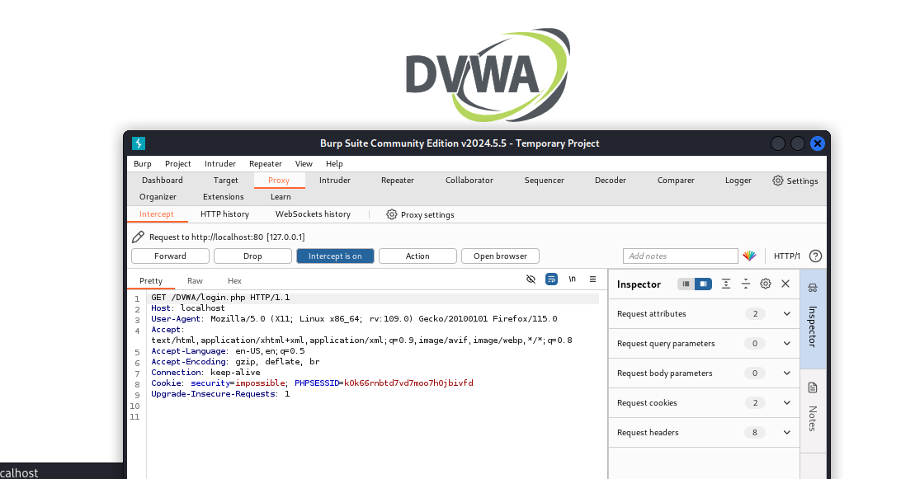
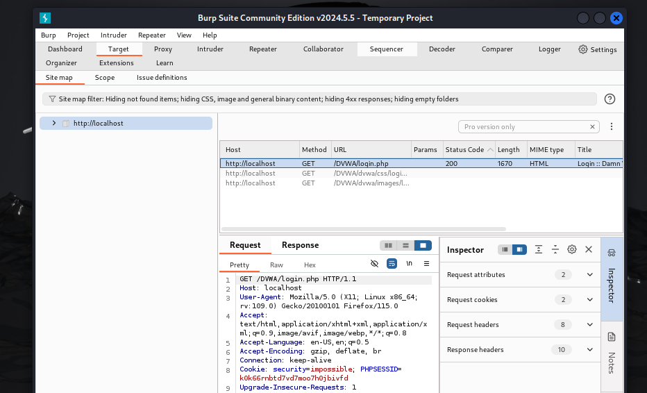
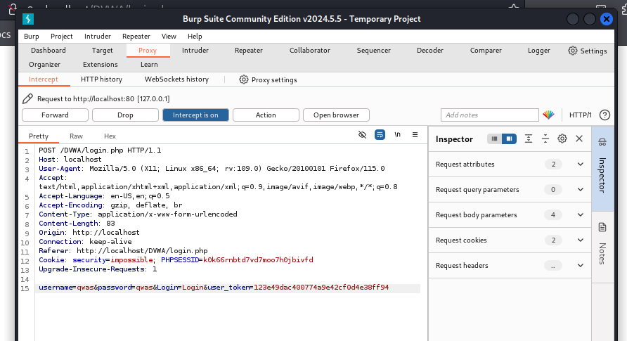
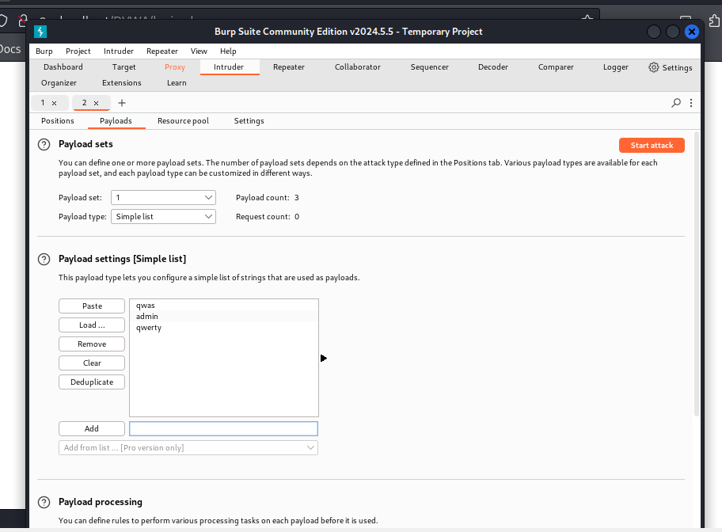
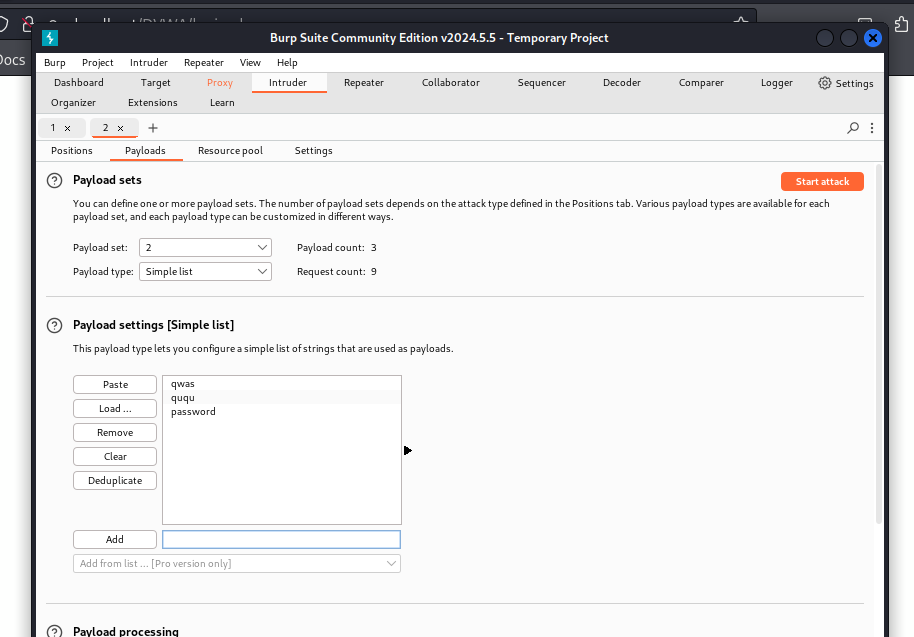
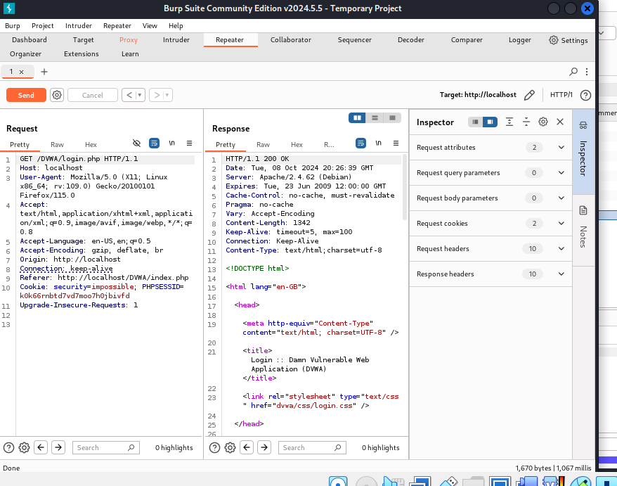

---
## Front matter
lang: ru-RU
title: Презентация к 5 этапу индивидуального проекта
author: Бабина Ю.О.
group: НПМбд-02-21

## Formatting
toc: false
slide_level: 2
theme: metropolis
header-includes: 
 - \metroset{progressbar=frametitle,sectionpage=progressbar,numbering=fraction}
 - '\makeatletter'
 - '\beamer@ignorenonframefalse'
 - '\makeatother'
aspectratio: 43
section-titles: true
---

# Презентация к 5 этапу индивидуального проекта

# Цель работы

Приобретение практических навыков по использованию Burp Suite - набором мощных инструментов безопасности веб-приложений, которые демонстрируют реальные возможности злоумышленника, проникающего в веб-приложения.

# Выполнение работы

## Запуск сервисов

## Запуск Burp Suite 

## Настройки проекта

## Настройки браузера

## Настройки в Burp Suite

## Включение внедрения Burp Suite

## Изменение перменных браузера

##  Перехваченный запрос

##  Загрузка страницы

## Раздел Target

## Перехват отправки формы

## Попытка подбора логина и пароля

## Имитация атаки

## Имя скрипта

## Раздел Repeater

## Разметка страницы авторизации

## Раздел Render

# Вывод

## В рамках выполнения данной лабораторной работы я приобрела практический навык по использованию Burp Suite - набора мощных инструментов безопасности веб-приложений, которые демонстрируют реальные возможности злоумышленника, проникающего в веб-приложения.
