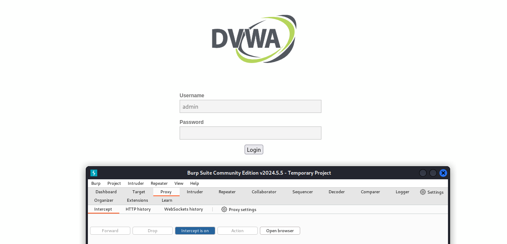

# **Отчет к 5  этапу индивидуального проекта**
## **Common information**
discipline: Основы информационной безопасности  
group: НПМбд-02-21  
author: Бабина Ю. О.
---
---
## **Цель работы**

Приобретение практических навыков по использованию Burp Suite - набором мощных инструментов безопасности веб-приложений, которые демонстрируют реальные возможности злоумышленника, проникающего в веб-приложения.

## **Выполнение работы**

Для работы приложения запустим сервесы Apache2 и MySQL:

Далее запустим Burp Suite с помощью команды: "barpsuit".

Создадим проект в оперативной памяти и выберем настройки по умолчанию:

Теперь для интеграции с браузером произведем его настройки в разделе Settings.

Настроим прокси:

Теперь перейдем в Burp Suite и проверим настройки страницы и прокси:

Перейдем во вкладку Proxy и включим внедрение Burp Suite:

Также не забудем задать перменной network_allow_hijacking_localhost значение true:

Перейдем по адресу http://localhost/DWVA/. Страница прогружается, а во вкладке Proxy появляется захваченный запрос:

Нажмем кнопку Forward, чтобы загрузить страницу:

Все запросы можно найти в разделе Target:

Попробуем ввести невалидные данные в форму, нажмем кнопку Login. В окне Burp Suite появятся введенные в поля формы значения:

Попробуем подобрать логин пароль для аутентификации. Для этого в разделе Target нажмем на запрос правой кнопкой мыши и в меню выберем Send to intruder. Во вкладке Intruder выберем тип атаки и Cluster Bomb и выделим значения специальным символом:

Заполним произвольные значения логинов и паролей в двух списках:

и нажмем кнопку Start attack:

Выберем верную пару логина и пароля (admin и password), увидев имя скрипта, отрабатываемый при отправке формы:

Откроем данный запрос в разделе Repeater и нажмем кнопку Send:

В правом окне увидим знакомый нам вывод, однако, нажав на кнопку Follow redirections, получим ответ с разметкой страницы с формой авторизации:

Отобразим ее в разделе Render:

## Вывод
В рамках выполнения данной лабораторной работы я приобрела практический навык по использованию Burp Suite - набора мощных инструментов безопасности веб-приложений, которые демонстрируют реальные возможности злоумышленника, проникающего в веб-приложения.

## Список литературы ##
* https://www.kali.org/
* https://github.com/digininja/DVWA?tab=readme-ov-file 
* https://blog.eldernode.com/configure-burp-suite-on-kali-linux/
* https://habr.com/ru/companies/yandex_praktikum/articles/770668/ 